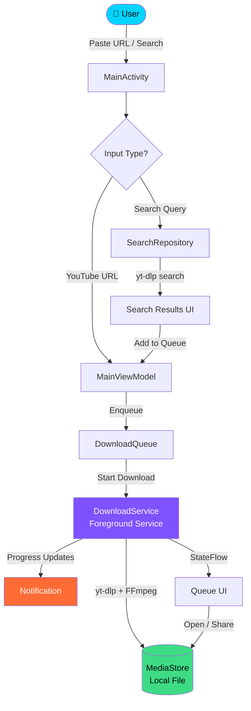

<p align="center">
  
</p>

<div align="center">

[](https://git.io/typing-svg)

</div>

<div align="center">


**A powerful, beautiful YouTube downloader for Android built with Jetpack Compose**

[⬇️ Download APK](https://drive.google.com/file/d/13HQLQyJaN9MdxW8BPM3dLOZNOvq-98J3/view?usp=drive_link) • [🐛 Report Bug](https://github.com/issues) • [💡 Request Feature](https://github.com/issues)

</div>

---

## 📱 Screenshots

<div align="center">
  <table style="width:100%">
    <tr>
      <td width="33%" align="center">
        
      </td>
      <td width="33%" align="center">
        
      </td>
      <td width="33%" align="center">
        
      </td>
    </tr>
    <tr>
      <td align="center"><b>Smart Search</b></td>
      <td align="center"><b>Active Queue</b></td>
      <td align="center"><b>Playlist Selection</b></td>
    </tr>
  </table>
</div>

---

## ✨ Features

### 🎬 Core Download Features

* **Download YouTube videos** in multiple qualities — 4K, 2K, 1080p, 720p, 480p, 360p
* **Audio-only downloads** — MP3, M4A, Best Audio
* **Smart quality selection** — AV1 (smallest size), H.264 (most compatible), Max Bitrate
* **Accurate quality enforcement** — what you select is what you get, no surprise quality switches
* **Playlist support** — download entire playlists or select specific videos

### 🔍 Built-in YouTube Search

* Search YouTube directly inside the app — no browser needed
* Paste a URL or type any search query
* Browse results with thumbnails, uploader name, and duration
* One-tap add any result to the download queue

### 📋 Download Queue

* Add multiple videos to a queue — downloads happen one after another automatically
* Live download progress per queue item with circular progress indicator
* Download speed display (MB/s or KB/s) per item
* Open and Share buttons appear instantly when each video finishes
* Clear completed downloads with one tap

### ⚡ Smart Queue Management

* While a video is downloading, freely search and add more videos to the queue
* The search panel and download section work completely independently
* Queue auto-starts next download immediately when current one finishes
* Cancel any active download without losing queued items

### 🔔 Background Download

* Downloads continue when the app is minimized
* Persistent foreground service notification shows:

  * Current video title
  * Download progress percentage
  * Download speed (MB/s)
  * ETA remaining
  * Queue count
* Cancel download directly from the notification

### ▶️ Playlist Selection

* Smart playlist detection — shows video count and title
* Download all or single video toggle
* **Select specific videos** from a playlist via a dialog:

  * All videos pre-selected by default
  * Select All / Deselect All buttons
  * Tap individual videos to toggle selection

### 📊 Download Info & Stats

* Video thumbnail preview with duration badge
* Channel/uploader name display
* Estimated file size shown per quality before downloading
* Actual downloaded file size shown after completion
* Open and Share the downloaded file directly from the app

### 🔄 Resume & Retry

* Failed downloads can be resumed from where they stopped
* Automatic retry options on failure
* Partial download cleanup on cancel

### 📋 Auto URL Detection

* Share a YouTube video directly from the YouTube app
* Open YouTube links directly in YT Downloader from any browser
* **Auto-paste clipboard detection** — when you reopen the app with a YouTube URL copied, a dialog prompts to add it automatically

### ⭐ Quality Memory

* Remembers your last used quality selection across app restarts

### 🔐 YouTube Login (Bot Detection Fix)

* Sign in to YouTube via built-in WebView
* Fixes "Sign in to confirm you're not a bot" errors on some networks
* Cookies stored securely on device
* Sign out anytime from Settings

### ⚙️ Settings

* Choose download save location:

  * Movies/YTDownloader
  * Downloads/YTDownloader
  * Music/YTDownloader
  * DCIM/YTDownloader
* Cache & temp file manager with size display
* One-tap deep clean of all cache and temp files
* YouTube login / logout management

### 🎨 Beautiful UI

* Dark navy gradient theme with cyan accent colors
* Smooth animations throughout — slide in, fade in, expand
* Animated search results disappear when adding to queue
* Glowing card borders and gradient progress bars
* Clean, modern Material 3 design

---

## 📲 Download & Install

### Direct APK Download

👉 **[Download Latest APK](https://drive.google.com/file/d/13HQLQyJaN9MdxW8BPM3dLOZNOvq-98J3/view?usp=drive_link)**

### Installation Steps

1. Download the APK from the link above
2. On your Android device, go to **Settings → Security**
3. Enable **"Install from Unknown Sources"** (or allow your browser/file manager when prompted)
4. Open the downloaded APK file
5. Tap **Install**
6. Open **YT Downloader** and enjoy!

> ⚠️ **Note:** Android may warn about installing apps from unknown sources. This is normal for APKs not from the Play Store. The app is safe and open source.

---

## 🛠️ Build from Source

### Prerequisites

* Android Studio Ladybug or newer
* JDK 11+
* Android SDK with API 36
* Git

### Steps

```bash
# Clone the repository
git clone https://github.com/atanucsejgec/Youtube_Video_Downloader_Best_Quality.git

# Enter the directory
cd Youtube_Video_Downloader_Best_Quality

# Build debug APK
./gradlew assembleDebug
```

### Build Requirements

* **minSdk**: 24 (Android 7.0)
* **targetSdk**: 36 (Android 15/16 Preview)
* **ABIs**: `arm64-v8a`, `armeabi-v7a` (Optimized for physical devices)

---

## 🏗️ Tech Stack

<div align="center">

[](https://skillicons.dev)

</div>

| Technology                 | Purpose                   |
| -------------------------- | ------------------------- |
| Kotlin                     | Primary language          |
| Jetpack Compose            | UI framework              |
| Material 3                 | Design system             |
| yt-dlp (youtubedl-android) | YouTube download engine   |
| FFmpeg                     | Video/audio merging       |
| Coil                       | Image loading             |
| Kotlin Coroutines          | Async operations          |
| StateFlow                  | Reactive state management |
| ViewModel                  | UI state holder           |
| Foreground Service         | Background downloads      |
| MediaStore API             | Gallery saving            |
| WebView                    | YouTube login             |

---

## 🗺️ App Architecture



---

## 📁 Project Structure

```text
app/src/main/java/com/example/youtubedownloader/

├── MainActivity.kt               # Entry point, URL intent handling
├── MainViewModel.kt              # Core logic, state management, downloads
├── DownloadService.kt            # Foreground service for background downloads
├── DownloadQueue.kt              # Queue state management
├── SearchRepository.kt           # YouTube search via yt-dlp
├── CacheManager.kt               # Cache cleanup utilities
├── CookieHelper.kt               # YouTube auth cookie management
├── DownloadPrefs.kt              # User preferences & download location

└── ui/
    ├── DownloadScreen.kt
    ├── SearchComponents.kt
    ├── QueueComponents.kt
    ├── DownloadProgressCard.kt
    ├── CompletedCard.kt
    ├── PlaylistSelectionDialog.kt
    └── YouTubeLoginScreen.kt
```

---

## 🔑 Permissions

| Permission                   | Reason                               |
| ---------------------------- | ------------------------------------ |
| INTERNET                     | Download videos and search YouTube   |
| FOREGROUND_SERVICE           | Keep downloads running in background |
| FOREGROUND_SERVICE_DATA_SYNC | Background download service type     |
| POST_NOTIFICATIONS           | Show download progress notification  |
| WRITE_EXTERNAL_STORAGE       | Save files on Android 8 and below    |

---

## 🚀 How to Use

### Download a Single Video

1. Open the app
2. Paste a YouTube URL or type a search query
3. Tap **Search Video**
4. Select video
5. Choose quality
6. Tap **DOWNLOAD**

### Search YouTube & Download

* Type search term
* Tap **Search Video**
* Tap **+** to add
* Select quality
* Tap **DOWNLOAD**

### Queue Multiple Downloads

* Start one download
* Add more while downloading
* Queue continues automatically

### Download a Playlist

* Paste playlist URL
* Select videos
* Download all or selected

### Background Download

* Press home button
* Track progress via notification

---

## ⚙️ Supported Formats

### Video

* MP4 (360p–4K)
* MKV
* WebM

### Audio

* MP3
* M4A
* Original format

---

## ❓ FAQ

**Q: Why bot error?**
Sign in from Settings

**Q: Slow download?**
Depends on network

**Q: Where files saved?**
Movies/YTDownloader

**Q: Shorts supported?**
Yes

---

## ⚠️ Disclaimer

This app is intended for personal use only. Respect YouTube's Terms of Service.

---

## 👨‍💻 Developer

<div align="center">

**Atanu Biswas**

[](https://github.com/atanucsejgec)
[](https://www.linkedin.com/in/atanu-biswas-58aa0b28b/)
[](https://www.instagram.com/atanubiswas7450/)

Built with ❤️ for the Android community

</div>

---

## 🤝 Contributors

<div align="center">

[](https://github.com/atanucsejgec/Youtube_Video_Downloader_Best_Quality/graphs/contributors)

*Thank you to everyone who has contributed to this project!*

</div>

---

## 📄 License

```text
MIT License

Copyright (c) 2025 Atanu Biswas

Permission is hereby granted, free of charge...
```

---

## 🙏 Acknowledgements

* yt-dlp
* youtubedl-android
* FFmpeg
* Coil
* Jetpack Compose

---

<div align="center">

⭐ If you find this app useful, please star the repository! ⭐

[⬇️ Download APK](https://drive.google.com/file/d/13HQLQyJaN9MdxW8BPM3dLOZNOvq-98J3/view?usp=drive_link)

</div>

<p align="center">
  
</p>
