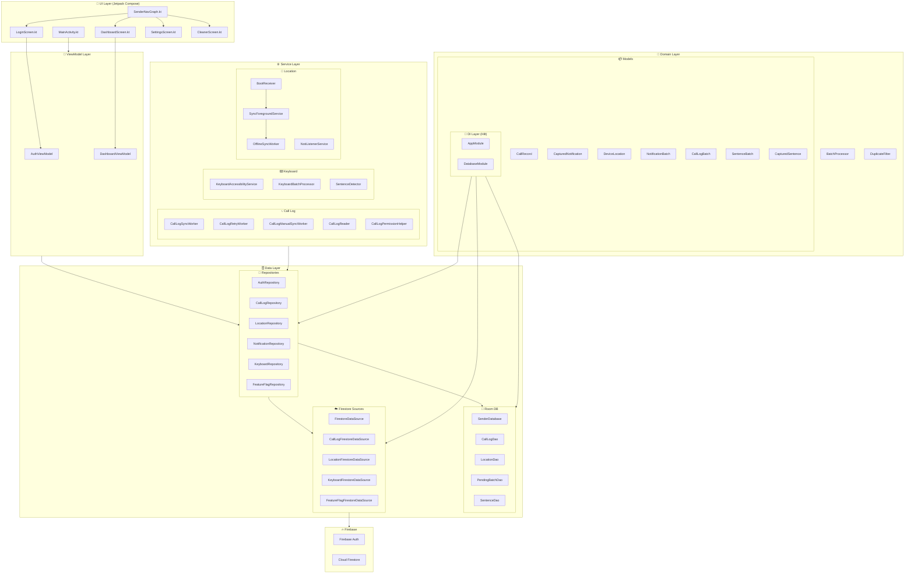
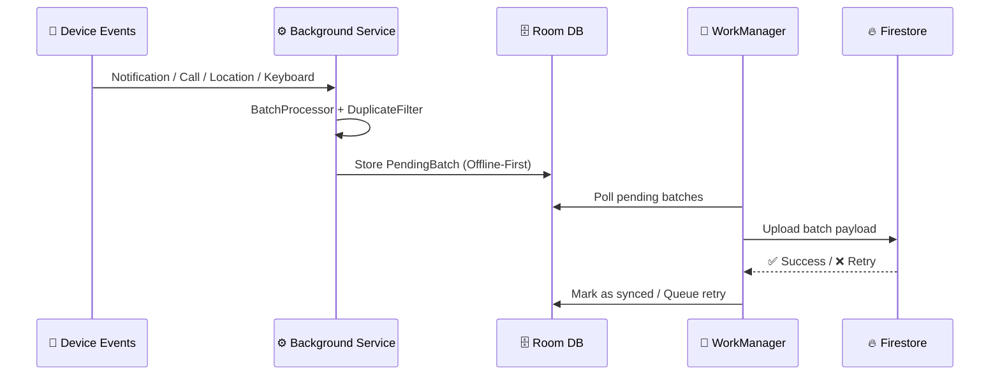
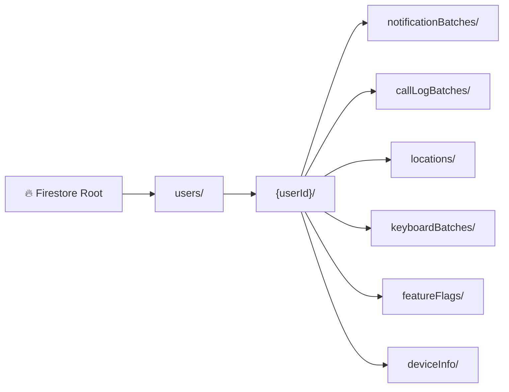
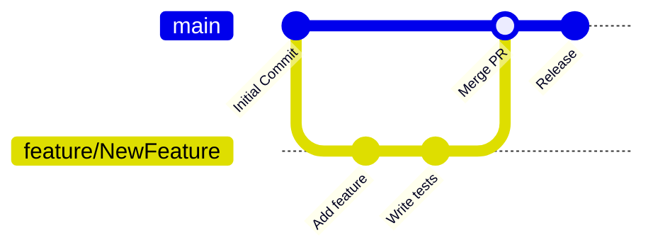

<div align="center">


<br/>

[](https://git.io/typing-svg)

<br/>

[](https://android.com)
[](https://kotlinlang.org)
[](https://firebase.google.com)
[](LICENSE)
[](https://github.com/atanucsejgec/NotiSync_Sender/stargazers)
[](https://github.com/atanucsejgec/NotiSync_Sender/issues)
[](https://github.com/atanucsejgec/NotiSync_Sender/commits)

<br/>

> 📡 **NotiSync Sender** is the powerhouse Android application designed to capture and broadcast system events — including notifications, call logs, keyboard inputs, and GPS location — to a secure Firebase cloud for real-time monitoring.

<br/>

[🚀 Getting Started](#️-installation) • [🔥 Firebase Setup](#-firebase-setup-required) • [📁 Structure](#-project-structure) • [🗺️ Roadmap](#️-roadmap) • [🤝 Contribute](#-contributing)

</div>

---

## 📖 Table of Contents

- [📌 About](#-about)
- [📸 Screenshots](#-screenshots)
- [✨ Features](#-features)
- [🛠️ Tech Stack](#️-tech-stack)
- [🏗️ Architecture](#️-architecture)
- [⚙️ Installation](#️-installation)
- [🔥 Firebase Setup](#-firebase-setup-required)
- [📁 Project Structure](#-project-structure)
- [🗺️ Roadmap](#️-roadmap)
- [🤝 Contributing](#-contributing)
- [👥 Contributors](#-contributors)
- [📄 License](#-license)
- [📬 Contact](#-contact)

---

## 📌 About

**NotiSync Sender** is a robust Android utility built with **Jetpack Compose**, **Hilt**, and **Firebase**. It serves as the data source in the NotiSync ecosystem, monitoring the host device and synchronizing sensitive event data to the cloud in real-time.

The app is engineered around **Clean Architecture** and **MVVM** principles, ensuring modularity, testability, and long-term maintainability. It includes advanced capabilities like **keyboard input capture**, **batch processing with deduplication**, **offline-first sync** via Room DB, and **WorkManager**-powered background resilience.

### 🎯 Use Cases

| Scenario | How NotiSync Sender Helps |
|---|---|
| 📱 Remote Monitoring | Broadcast device status to a centralized receiver |
| 🛡️ Anti-Theft / Recovery | Constant GPS location broadcasting to Firebase |
| 💼 Professional Logs | Automated cloud backup of work-related call logs |
| 🔔 Notification Mirroring | Forward critical alerts to other linked devices |
| ⌨️ Input Analysis | Capture and batch-process keyboard sentences |
| 📶 Offline-First Design | Local Room DB ensures zero data loss during connectivity gaps |

---

## 📸 Screenshots

> 💡 Visualizing the modern Material 3 interface.

<div align="center">

<table>
  <tr>
    <td align="center"><b>🏠 Dashboard</b></td>
    <td align="center"><b>🔐 All Permission</b></td>
    <td align="center"><b>🔔 Permission Setup</b></td>
    <td align="center"><b>⚙️ Settings</b></td>
  </tr>
  <tr>
    <td>
      
    </td>
    <td>
      
    </td>
    <td>
      
    </td>
    <td>
      
    </td>
  </tr>
</table>

</div>

---

## ✨ Features

<table>
  <tr>
    <td>🔔 <b>Notification Capture</b></td>
    <td>Monitors status bar notifications via <code>NotiListenerService</code> and broadcasts them to Firebase Firestore in real-time with batch processing</td>
  </tr>
  <tr>
    <td>📍 <b>Real-time GPS Tracking</b></td>
    <td>Utilizes Fused Location Provider for accurate, battery-efficient location syncing. Uses <code>OfflineSyncWorker</code> for resilient delivery</td>
  </tr>
  <tr>
    <td>📞 <b>Call Log Broadcaster</b></td>
    <td>Detects and uploads incoming/outgoing call history automatically via <code>CallLogSyncWorker</code>, <code>CallLogRetryWorker</code>, and manual sync support</td>
  </tr>
  <tr>
    <td>⌨️ <b>Keyboard Input Capture</b></td>
    <td>Uses <code>KeyboardAccessibilityService</code> and <code>SentenceDetector</code> to capture, batch, and sync typed sentences via <code>KeyboardBatchProcessor</code></td>
  </tr>
  <tr>
    <td>📦 <b>Batch Processing & Deduplication</b></td>
    <td>Domain-level <code>BatchProcessor</code> and <code>DuplicateFilter</code> ensure clean, optimized payloads are pushed to Firestore</td>
  </tr>
  <tr>
    <td>📶 <b>Offline-First Architecture</b></td>
    <td>Room DB with entities like <code>PendingBatchEntity</code>, <code>PendingCallLogBatchEntity</code>, and <code>PendingLocationEntity</code> ensures no data is lost offline</td>
  </tr>
  <tr>
    <td>🔐 <b>Dynamic Permissions</b></td>
    <td>Graceful handling of Location, Call Log, Notification, and Accessibility permissions (Android 13+)</td>
  </tr>
  <tr>
    <td>🎨 <b>Material 3 & Compose</b></td>
    <td>State-of-the-art UI with edge-to-edge support, dynamic theming across Dashboard, Login, Settings, and Cleaner screens</td>
  </tr>
  <tr>
    <td>💉 <b>Hilt Dependency Injection</b></td>
    <td>Clean, testable codebase using Dagger Hilt with <code>AppModule</code> and <code>DatabaseModule</code> for service management</td>
  </tr>
  <tr>
    <td>🔄 <b>WorkManager Integration</b></td>
    <td><code>SyncForegroundService</code> and <code>OfflineSyncWorker</code> ensure background synchronization survives app kills and device reboots via <code>BootReceiver</code></td>
  </tr>
  <tr>
    <td>🚩 <b>Feature Flag System</b></td>
    <td><code>FeatureFlagRepository</code> and <code>FeatureFlagFirestoreDataSource</code> allow remote toggling of app capabilities without updates</td>
  </tr>
</table>

---

## 🛠️ Tech Stack

<div align="center">

[](https://skillicons.dev)

</div>

<br/>

| Category | Technology |
|---|---|
| 🌐 Language | Kotlin 1.9+ |
| 🎨 UI Framework | Jetpack Compose + Material 3 |
| 🏛️ Architecture | MVVM + Clean Architecture |
| 💉 Dependency Injection | Hilt (v2.56.2) |
| ☁️ Backend | Firebase Auth & Firestore |
| 🗄️ Local Database | Room DB (with DAOs, Entities, TypeConverters) |
| 🔄 Async Processing | Coroutines & Flow |
| 🧭 Navigation | Navigation Compose (v2.9.0) |
| 🔁 Background Work | WorkManager + ForegroundService + BootReceiver |
| ⌨️ Input Monitoring | AccessibilityService (KeyboardAccessibilityService) |
| 📦 Batch Sync | Custom BatchProcessor + DuplicateFilter |
| 🚩 Feature Flags | Firestore-backed FeatureFlagRepository |

---

## 🏗️ Architecture

NotiSync Sender follows **Clean Architecture** principles layered with **MVVM** to ensure a scalable, testable, and maintainable codebase.

### 📐 High-Level Architecture Diagram



### 🔄 Data Flow Diagram



### 🧱 Layer Responsibilities

| Layer | Component | Responsibility |
|---|---|---|
| **UI** | `DashboardScreen`, `LoginScreen`, `SettingsScreen`, `CleanerScreen` | Compose-based screens observing `StateFlow` from ViewModels |
| **ViewModel** | `AuthViewModel`, `DashboardViewModel` | Business logic, state management, bridging UI and repositories |
| **Domain** | `BatchProcessor`, `DuplicateFilter`, Models | Pure Kotlin domain logic, no Android dependencies |
| **Data/Remote** | `FirestoreDataSource`, `CallLogFirestoreDataSource`, etc. | Firebase Firestore CRUD operations |
| **Data/Local** | `SenderDatabase`, DAOs, Entities | Room DB offline persistence |
| **Data/Repository** | `AuthRepository`, `CallLogRepository`, etc. | Single source of truth, coordinating remote + local |
| **Service** | `CallLogSyncWorker`, `KeyboardAccessibilityService`, `SyncForegroundService` | Background event capture and sync |
| **DI** | `AppModule`, `DatabaseModule` | Hilt modules providing singletons |

---

## ⚙️ Installation

### Prerequisites

- ✅ Android Studio **Ladybug** or newer
- ✅ JDK **17+**
- ✅ Android device running **API 26+** (Oreo)
- ✅ A configured **Firebase Project**

### Steps

**1. Clone the repository**

```bash
git clone https://github.com/atanucsejgec/NotiSync_Sender.git
cd NotiSync_Sender
```

**2. Add Firebase Config**

- Download `google-services.json` from your [Firebase Console](https://console.firebase.google.com/).
- Place it in the `app/` directory.

**3. Build and Deploy**

- Open in **Android Studio**.
- Click **Sync Project with Gradle Files**.
- Press `Shift + F10` to run on your device or emulator.

**4. Enable Accessibility Service (for Keyboard Capture)**

- Go to **Settings → Accessibility → Installed Services → NotiSync Sender** → Enable.

**5. Enable Notification Listener (for Notification Capture)**

- Go to **Settings → Notifications → Notification Access → NotiSync Sender** → Enable.

---

## 🔥 Firebase Setup (Required)

### Step 1 — Create Project

- Go to [Firebase Console](https://console.firebase.google.com/) and create a new project named `NotiSync`.

### Step 2 — Register Android App

- Use package name: `com.app.notisync_sender`
- Download `google-services.json` and place in `app/`

### Step 3 — Enable Firestore & Auth

- **Authentication:** Enable **Email/Password** sign-in method.
- **Firestore:** Create a database in **Test Mode** (switch to production rules before deployment).

### Step 4 — Recommended Firestore Security Rules

```javascript
rules_version = '2';
service cloud.firestore {
  match /databases/{database}/documents {
    match /users/{userId}/{document=**} {
      allow read, write: if request.auth != null && request.auth.uid == userId;
    }
  }
}
```

### Step 5 — Firestore Collections Structure



---

## 📁 Project Structure

> 📸 *Reflecting the actual source tree from Android Studio:*

```
app/src/main/java/com/app/notisync_sender/
│
├── 📂 data/
│   ├── 📂 local/                          # Room Database Layer
│   │   ├── BatchTypeConverter.kt
│   │   ├── CallLogDao.kt
│   │   ├── CallLogTypeConverter.kt
│   │   ├── LocationDao.kt
│   │   ├── PendingBatchDao.kt
│   │   ├── PendingBatchEntity.kt
│   │   ├── PendingCallLogBatchEntity.kt
│   │   ├── PendingLocationEntity.kt
│   │   ├── PendingSentenceBatchEntity.kt
│   │   ├── ProcessedLocationRequestEntity.kt
│   │   ├── SenderDatabase.kt
│   │   ├── SentenceDao.kt
│   │   ├── SentenceTypeConverter.kt
│   │   └── SyncedCallLogEntity.kt
│   │
│   ├── 📂 remote/                         # Firebase Firestore Sources
│   │   ├── CallLogFirestoreDataSource.kt
│   │   ├── FeatureFlagFirestoreDataSource.kt
│   │   ├── FirestoreDataSource.kt
│   │   ├── KeyboardFirestoreDataSource.kt
│   │   └── LocationFirestoreDataSource.kt
│   │
│   └── 📂 repository/                     # Repository Implementations
│       ├── AuthRepository.kt
│       ├── CallLogRepository.kt
│       ├── FeatureFlagRepository.kt
│       ├── KeyboardRepository.kt
│       ├── LocationRepository.kt
│       └── NotificationRepository.kt
│
├── 📂 di/                                 # Hilt Dependency Injection
│   ├── AppModule.kt
│   └── DatabaseModule.kt
│
├── 📂 domain/                             # Pure Business Logic
│   ├── 📂 model/                          # Domain Data Models
│   │   ├── CallLogBatch.kt
│   │   ├── CallRecord.kt
│   │   ├── CapturedNotification.kt
│   │   ├── CapturedSentence.kt
│   │   ├── DeviceInfo.kt
│   │   ├── DeviceLocation.kt
│   │   ├── LocationRequest.kt
│   │   ├── NotificationBatch.kt
│   │   └── SentenceBatch.kt
│   │
│   └── 📂 processor/                      # Domain Processing
│       ├── BatchProcessor.kt
│       └── DuplicateFilter.kt
│
├── 📂 service/                            # Background Services
│   ├── 📂 calllog/                        # Call Log Sync Services
│   │   ├── CallLogManualSyncWorker.kt
│   │   ├── CallLogPermissionHelper.kt
│   │   ├── CallLogReader.kt
│   │   ├── CallLogRetryWorker.kt
│   │   └── CallLogSyncWorker.kt
│   │
│   ├── 📂 keyboard/                       # Keyboard Capture Services
│   │   ├── KeyboardAccessibilityService.kt
│   │   ├── KeyboardBatchProcessor.kt
│   │   └── SentenceDetector.kt
│   │
│   └── 📂 location/                       # Location & Notification Services
│       ├── BootReceiver.kt
│       ├── NotiListenerService.kt
│       ├── OfflineSyncWorker.kt
│       └── SyncForegroundService.kt
│
├── 📂 ui/
│   ├── 📂 navigation/                     # Navigation Graph
│   │   └── SenderNavGraph.kt
│   │
│   ├── 📂 screens/                        # Compose Screens
│   │   ├── CleanerScreen.kt
│   │   ├── DashboardScreen.kt
│   │   ├── LoginScreen.kt
│   │   └── SettingsScreen.kt
│   │
│   └── 📂 theme/                          # Material 3 Theming
│       └── (Color, Typography, Theme files)
│
├── 📂 viewmodel/                          # ViewModels
│   ├── AuthViewModel.kt
│   └── DashboardViewModel.kt
│
├── MainActivity.kt                        # Entry point & Permission Launcher
└── NotiSyncSenderApp.kt                   # Hilt Application Class
```

---

## 🗺️ Roadmap

```mermaid
graph LR
    subgraph DONE["✅ Completed"]
        A[Jetpack Compose UI]
        B[Permission Request System]
        C[Firebase Auth and Firestore]
        D[Room DB Offline First]
        E[Keyboard Capture Service]
        F[Call Log Sync Workers]
        G[Batch Processing]
        H[Feature Flag System]
    end

    subgraph WIP["🔄 In Progress"]
        I[WorkManager Sync Triggers]
        J[Cleaner Screen]
    end

    subgraph PLAN["📋 Planned"]
        K[Battery Optimization]
        L[End to End Encryption]
        M[SMS Synchronization]
        N[Receiver Companion App]
    end

    DONE --> WIP --> PLAN
```



| Status | Feature |
|---|---|
| ✅ Done | Jetpack Compose UI with Scaffold |
| ✅ Done | Permission Request system (Location, Calls, Notifications, Accessibility) |
| ✅ Done | Firebase Auth & Firestore Integration |
| ✅ Done | Room DB Offline-First Architecture |
| ✅ Done | Keyboard Capture with Sentence Detection |
| ✅ Done | Call Log Sync with Retry Workers |
| ✅ Done | Batch Processing & Duplicate Filtering |
| ✅ Done | Feature Flag System via Firestore |
| 🔄 In Progress | Optimized WorkManager sync triggers |
| 🔄 In Progress | Cleaner Screen Implementation |
| 📋 Planned | Battery Optimization Profiles |
| 📋 Planned | End-to-End Encryption for local logs |
| 📋 Planned | SMS Synchronization Support |
| 💡 Idea | NotiSync Receiver companion app |

---

## 🤝 Contributing

We welcome contributions! 🚀



1. **Fork** the project
2. **Create** your feature branch
   ```bash
   git checkout -b feature/NewFeature
   ```
3. **Commit** your changes
   ```bash
   git commit -m 'feat: Add some NewFeature'
   ```
4. **Push** to the branch
   ```bash
   git push origin feature/NewFeature
   ```
5. **Open** a Pull Request 🎉

### 📋 Contribution Guidelines

- Follow **Kotlin coding conventions**
- Write **unit tests** for new domain logic
- Use **conventional commits** (`feat:`, `fix:`, `docs:`, `refactor:`)
- Update **documentation** for any architectural changes
- Ensure **Hilt DI** is properly used — no manual instantiation in production code

---

## 👥 Contributors

<div align="center">

[](https://github.com/atanucsejgec/NotiSync_Sender/graphs/contributors)

*Made with [contrib.rocks](https://contrib.rocks)*

</div>

---

## 📄 License

Distributed under the **MIT License**. See [`LICENSE`](LICENSE) for more information.

```
MIT License

Copyright (c) 2024 Atanu Biswas

Permission is hereby granted, free of charge, to any person obtaining a copy
of this software and associated documentation files (the "Software"), to deal
in the Software without restriction...
```

---

## 📬 Contact

<div align="center">

**Atanu Biswas**

[](https://github.com/atanucsejgec)
[](https://github.com/atanucsejgec/NotiSync_Sender)

📌 **Project Link:** [https://github.com/atanucsejgec/NotiSync_Sender](https://github.com/atanucsejgec/NotiSync_Sender)

</div>

---

<div align="center">

### ⭐ If NotiSync Sender helps you, please consider giving it a star! ⭐


</div>
