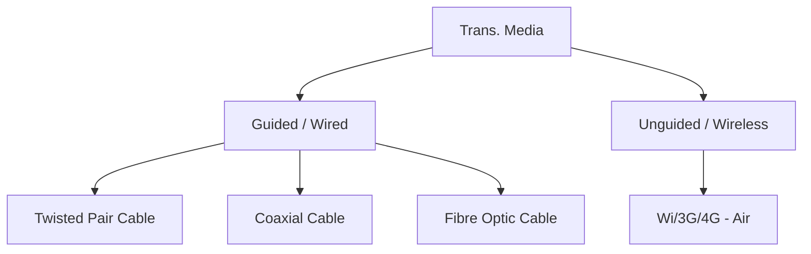

# Computer Networks — Handwritten Notes

---

## Date: 2/3/26

### TCP / OSI Layer Model

```
Application  |  Presentation  | ← apply encryption
             |    Session     |
IP {         Transmission
             Network
             Datalink
             Physical
             Data → Signal
```

> **Layer Stack (TCP/IP):**
> - Application / Presentation / Session ← *apply encryption*
> - Transmission
> - Network
> - Datalink
> - Physical
> - Data → Signal

---

## Date: 16/3/26

### * Data: information in some form

### * Data Communication: exchange of data.

**Components →**
- o message
- o sender / receivers
- o transmission medium
- o protocol.

---

### * Data Flow Mode

i) **Simplex** — one way

ii) **Half Duplex** — receive and send, but not at same time

iii) **Full Duplex** — simultaneous receive and send

---

### * Communication Types

i) P2P
ii) Multipoint

---

<!-- PAGE RIGHT COLUMN — Page 1 -->

## * Topology

> How the rest network is laid down.

### i) Mesh — every device has dedicated P2P.


---

### ii) Star — hub connected to each machine.


---

### iii) Bus — one long cable.


---

### iv) Ring — P2P with 2 adjacent machines only.


---

### v) Hybrid — Mix of all


---
<!-- PAGE BREAK -->
---

## Page 2

---

## * Categories —

- **LAN** — privately owned network
- **MAN** — area inside town or city
- **WAN** — large geographic area

---

## OSI Model


**→ Physical** — responsible for movement of individual bits.

**→ Data Link** — movement of frames from one hop to next.
> *[Hop to Hop delivery]*

**→ Network** — delivery of individual packages.
> *[End to end delivery]*

**→ Transport** — delivery of a message from one process to another.

---

## Date: 8/4/26

## Transmission Media

| Layer | Scope |
| :--- | :--- |
| Application | |
| Transport | Process to Process |
| Network | Source to Destination |
| Data Link | Hub to Hub |
| Physical | Through transmission medium |

---

<!-- RIGHT COLUMN — Page 2 -->

### Transmission Channel Diagram

```
Sender                        Receiver
[Phy Layer]                 [Phy Layer]
       ↘    Transmission Channel   ↙
              [Trans. Media]
                   /        \
            Guided           Unguided
           (Wired)           (Wireless)
           /    \    \            \
      Twisted  Coaxial  Fibre    Wi/3G/4G
       Pair    Cable    Optic     (air)
       Cable            Cable
```


```mermaid
graph TD
    A[Trans. Media] --> B[Guided / Wired]
    A --> C[Unguided / Wireless]
    B --> D[Twisted Pair Cable]
    B --> E[Coaxial Cable]
    B --> F[Fibre Optic Cable]
    C --> G[Wi/3G/4G - Air]
```

---

### * Propagation Modes ...

- Step index ...
- Graded index ...
- Adv. / Disadv. of optical fibre

---

### Signals

- **Analog / Digital Data**
- **Periodic / Aperiodic Signals**

---
