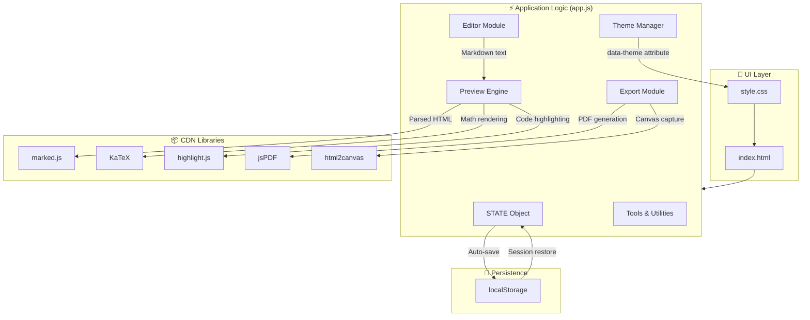
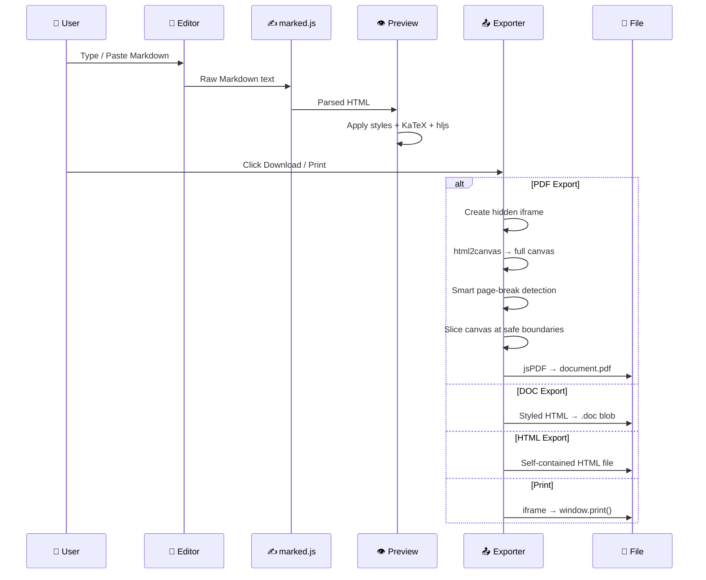
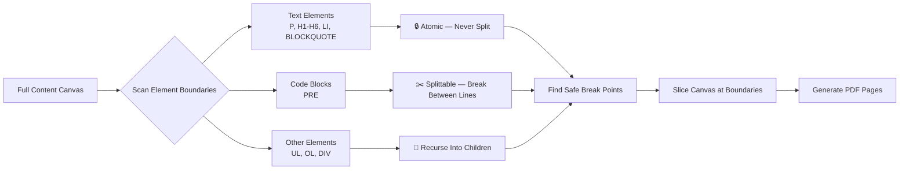
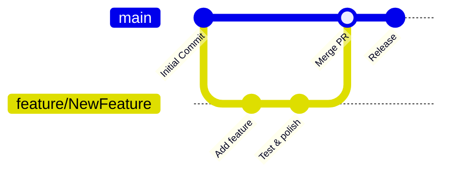

<div align="center">


<br/>

[](https://git.io/typing-svg)

<br/>

[](https://developer.mozilla.org/en-US/docs/Web/HTML)
[](https://developer.mozilla.org/en-US/docs/Web/CSS)
[](https://developer.mozilla.org/en-US/docs/Web/JavaScript)
[](LICENSE)
[](https://github.com/atanucsejgec/Markdown_to_Printable/stargazers)
[](https://github.com/atanucsejgec/Markdown_to_Printable/issues)
[](https://github.com/atanucsejgec/Markdown_to_Printable/commits)
[](https://atanucsejgec.github.io/Markdown_to_Printable/)

<br/>

> 📄 **MDConvert** is a powerful, browser-based Markdown converter that transforms your `.md` files into beautifully formatted **PDF**, **DOC**, and **HTML** documents — with a live preview, full typography control, dark mode, and zero server-side dependencies.

<br/>

[🌐 Website Link](https://atanucsejgec.github.io/Markdown_to_Printable/) • [🚀 Getting Started](#️-getting-started) • [✨ Features](#-features) • [🎯 Why MDConvert?](#-why-mdconvert) • [📁 Structure](#-project-structure) • [🤝 Contribute](#-contributing)

</div>

---

## 📖 Table of Contents

- [📌 About](#-about)
- [🎯 Why MDConvert?](#-why-mdconvert)
- [📸 Screenshots](#-screenshots)
- [✨ Features](#-features)
- [🛠️ Tech Stack](#️-tech-stack)
- [🏗️ Architecture](#️-architecture)
- [⚙️ Getting Started](#️-getting-started)
- [📁 Project Structure](#-project-structure)
- [🗺️ Roadmap](#️-roadmap)
- [🤝 Contributing](#-contributing)
- [👥 Contributors](#-contributors)
- [📄 License](#-license)
- [📬 Contact](#-contact)

---

## 📌 About

**MDConvert** is a feature-rich, client-side web application that converts Markdown into professionally formatted documents. Unlike cloud-based converters, **everything runs in your browser** — your data never leaves your machine.

Built with **vanilla HTML, CSS, and JavaScript**, it's lightweight, fast, and requires no build tools or server infrastructure. Just open `index.html` and start converting.

### 🎯 Why MDConvert?

<table>
  <tr>
    <td align="center">🔒</td>
    <td><b>100% Private</b></td>
    <td>Your documents never leave your browser. No server uploads, no cloud processing, no data collection. Everything is processed client-side.</td>
  </tr>
  <tr>
    <td align="center">⚡</td>
    <td><b>Zero Setup</b></td>
    <td>No <code>npm install</code>, no build step, no backend. Just open <code>index.html</code> in any modern browser and you're ready to go.</td>
  </tr>
  <tr>
    <td align="center">🎨</td>
    <td><b>Full Customization</b></td>
    <td>Control every detail — fonts, colors, margins, paper size, columns, spacing, line height. Your document, your rules.</td>
  </tr>
  <tr>
    <td align="center">👁️</td>
    <td><b>Live Preview</b></td>
    <td>See exactly how your document will look as you type, with synchronized scrolling between editor and preview.</td>
  </tr>
  <tr>
    <td align="center">📐</td>
    <td><b>Smart Page Breaks</b></td>
    <td>Intelligent page-break algorithm ensures text paragraphs never split across pages, while long code blocks break cleanly between lines.</td>
  </tr>
  <tr>
    <td align="center">🌙</td>
    <td><b>Dark Mode</b></td>
    <td>Beautiful dark theme that applies to both the UI and the document preview — easy on the eyes during late-night writing sessions.</td>
  </tr>
  <tr>
    <td align="center">📤</td>
    <td><b>Multi-Format Export</b></td>
    <td>Export to <b>PDF</b>, <b>DOC</b> (Word-compatible), <b>HTML</b>, or send directly to the <b>printer</b> — all from one tool.</td>
  </tr>
  <tr>
    <td align="center">🧮</td>
    <td><b>Math & Code Support</b></td>
    <td>Render LaTeX math equations with <b>KaTeX</b> and highlight code syntax with <b>highlight.js</b> — 8+ code themes available.</td>
  </tr>
</table>

---

## 📸 Screenshots

> 💡 A modern, responsive interface designed for productivity.

<div align="center">

  ## ☀️ Light Mode</b>
  <br>
  

  ## 🌙 Dark Mode</b>
  
  

</div>

---

## ✨ Features

<table>
  <tr>
    <td>📝 <b>Markdown Editor</b></td>
    <td>Full-featured textarea with monospace font, live character/word/line counts, and auto-save to <code>localStorage</code></td>
  </tr>
  <tr>
    <td>👁️ <b>Live Preview</b></td>
    <td>Real-time rendered preview on a paper-styled canvas with accurate page dimensions and margins</td>
  </tr>
  <tr>
    <td>🔗 <b>Sync Scroll</b></td>
    <td>Proportional scroll synchronization between editor and preview — toggle on/off instantly</td>
  </tr>
  <tr>
    <td>📕 <b>PDF Export</b></td>
    <td>Client-side PDF generation using <code>jsPDF</code> + <code>html2canvas</code> with smart page-break detection that avoids cutting through paragraphs</td>
  </tr>
  <tr>
    <td>📘 <b>DOC Export</b></td>
    <td>Word-compatible <code>.doc</code> download using MHTML format — opens perfectly in Microsoft Word and LibreOffice</td>
  </tr>
  <tr>
    <td>🌐 <b>HTML Export</b></td>
    <td>Self-contained, styled HTML file download — ready for web hosting or email embedding</td>
  </tr>
  <tr>
    <td>🖨️ <b>Print</b></td>
    <td>Direct browser print with full styling preserved — generates a clean print-ready iframe</td>
  </tr>
  <tr>
    <td>🌙 <b>Dark / Light Mode</b></td>
    <td>Full theme toggle that applies to UI chrome <i>and</i> the document preview. Persists across sessions</td>
  </tr>
  <tr>
    <td>🎨 <b>Typography Controls</b></td>
    <td>Relative or fixed font sizing, adjustable line height, heading/paragraph/list gap control, and 8+ font families</td>
  </tr>
  <tr>
    <td>🎯 <b>Color Customization</b></td>
    <td>Custom background, text, and link colors with live color pickers and hex display</td>
  </tr>
  <tr>
    <td>📐 <b>Page Setup</b></td>
    <td>A4, A3, A5, Letter, Legal paper sizes with portrait/landscape orientation and independent margin controls</td>
  </tr>
  <tr>
    <td>📰 <b>Multi-Column Layout</b></td>
    <td>1, 2, or 3 column layouts with proper column-gap and break-inside avoidance</td>
  </tr>
  <tr>
    <td>🧮 <b>KaTeX Math</b></td>
    <td>Inline <code>$...$</code> and display <code>$$...$$</code> math rendering powered by KaTeX</td>
  </tr>
  <tr>
    <td>💻 <b>Code Highlighting</b></td>
    <td>Syntax highlighting via <code>highlight.js</code> with 8 selectable themes (GitHub, Monokai, Dracula, Nord, etc.)</td>
  </tr>
  <tr>
    <td>🔍 <b>Find & Replace</b></td>
    <td>In-editor search with next/prev navigation, case-sensitive toggle, replace one, and replace all</td>
  </tr>
  <tr>
    <td>📑 <b>TOC Generator</b></td>
    <td>Auto-generate a clickable Table of Contents from your headings and insert it at the cursor position</td>
  </tr>
  <tr>
    <td>🛠️ <b>Markdown Toolbar</b></td>
    <td>Quick-insert buttons for headings, bold, italic, links, images, lists, tables, code blocks, and more</td>
  </tr>
  <tr>
    <td>⌨️ <b>Keyboard Shortcuts</b></td>
    <td><code>Ctrl+B</code> Bold, <code>Ctrl+I</code> Italic, <code>Ctrl+K</code> Link, <code>Ctrl+H</code> Find & Replace</td>
  </tr>
  <tr>
    <td>📂 <b>File Upload & Drag-Drop</b></td>
    <td>Load <code>.md</code>, <code>.txt</code>, or <code>.readme</code> files via file picker or drag-and-drop</td>
  </tr>
  <tr>
    <td>🎯 <b>Word Goal Tracker</b></td>
    <td>Set a word count target and track your progress with a visual progress bar</td>
  </tr>
  <tr>
    <td>💾 <b>Auto-Save</b></td>
    <td>Content and settings are periodically saved to <code>localStorage</code> and restored on next visit</td>
  </tr>
  <tr>
    <td>📋 <b>Clipboard Paste</b></td>
    <td>One-click paste from clipboard directly into the editor</td>
  </tr>
  <tr>
    <td>⛶ <b>Fullscreen Preview</b></td>
    <td>View the rendered document in fullscreen mode for distraction-free review</td>
  </tr>
</table>

---

## 🛠️ Tech Stack

<div align="center">

[](https://skillicons.dev)

</div>

<br/>

| Category | Technology |
|---|---|
| 🏗️ Structure | HTML5 (Semantic) |
| 🎨 Styling | Vanilla CSS3 (Custom Properties, Grid, Flexbox) |
| ⚡ Logic | Vanilla JavaScript (ES6+, no frameworks) |
| 📕 PDF Generation | [jsPDF](https://github.com/parallax/jsPDF) + [html2canvas](https://html2canvas.hertzen.com/) |
| ✍️ Markdown Parsing | [marked.js](https://marked.js.org/) |
| 💻 Syntax Highlighting | [highlight.js](https://highlightjs.org/) (8 themes) |
| 🧮 Math Rendering | [KaTeX](https://katex.org/) |
| 💾 Persistence | Browser `localStorage` |
| 📦 Dependencies | Zero build tools — all via CDN |

---

## 🏗️ Architecture

MDConvert uses a simple but effective **single-page architecture** with clear separation of concerns.

### 📐 Application Flow


```mermaid
graph TB
    subgraph UI["🎨 UI Layer"]
        HTML[index.html]
        CSS[style.css]
    end

    subgraph Logic["⚡ Application Logic (app.js)"]
        STATE[STATE Object]
        EDITOR[Editor Module]
        PREVIEW[Preview Engine]
        EXPORT[Export Module]
        THEME[Theme Manager]
        TOOLS[Tools & Utilities]
    end

    subgraph Libraries["📦 CDN Libraries"]
        MARKED[marked.js]
        JSPDF[jsPDF]
        H2C[html2canvas]
        HLJS[highlight.js]
        KATEX[KaTeX]
    end

    subgraph Storage["💾 Persistence"]
        LS[localStorage]
    end

    HTML --> Logic
    CSS --> HTML
    EDITOR -->|Markdown text| PREVIEW
    PREVIEW -->|Parsed HTML| MARKED
    PREVIEW -->|Math rendering| KATEX
    PREVIEW -->|Code highlighting| HLJS
    EXPORT -->|PDF generation| JSPDF
    EXPORT -->|Canvas capture| H2C
    STATE -->|Auto-save| LS
    LS -->|Session restore| STATE
    THEME -->|data-theme attribute| CSS
```

### 🔄 Export Pipeline


```mermaid
sequenceDiagram
    participant User as 👤 User
    participant Editor as 📝 Editor
    participant Parser as ✍️ marked.js
    participant Preview as 👁️ Preview
    participant Export as 📤 Exporter
    participant Output as 📄 File

    User->>Editor: Type / Paste Markdown
    Editor->>Parser: Raw Markdown text
    Parser->>Preview: Parsed HTML
    Preview->>Preview: Apply styles + KaTeX + hljs
    User->>Export: Click Download / Print
    
    alt PDF Export
        Export->>Export: Create hidden iframe
        Export->>Export: html2canvas → full canvas
        Export->>Export: Smart page-break detection
        Export->>Export: Slice canvas at safe boundaries
        Export->>Output: jsPDF → document.pdf
    else DOC Export
        Export->>Output: Styled HTML → .doc blob
    else HTML Export
        Export->>Output: Self-contained HTML file
    else Print
        Export->>Output: iframe → window.print()
    end
```

### 📐 Smart Page Break Algorithm


```mermaid
graph LR
    A[Full Content Canvas] --> B{Scan Element Boundaries}
    B --> C[Text Elements<br/>P, H1-H6, LI, BLOCKQUOTE]
    B --> D[Code Blocks<br/>PRE]
    B --> E[Other Elements<br/>UL, OL, DIV]
    
    C --> F[🔒 Atomic — Never Split]
    D --> G[✂️ Splittable — Break Between Lines]
    E --> H[📂 Recurse Into Children]
    
    F --> I[Find Safe Break Points]
    G --> I
    H --> I
    I --> J[Slice Canvas at Boundaries]
    J --> K[Generate PDF Pages]
```

---

## ⚙️ Getting Started

### Prerequisites

- ✅ Any modern web browser (Chrome, Firefox, Edge, Safari)
- ✅ That's it! No Node.js, no npm, no build tools needed.

### Quick Start

**1. Clone the repository**

```bash
git clone https://github.com/atanucsejgec/Markdown_to_Printable.git
cd Markdown_to_Printable
```

**2. Open in browser**

```bash
# Simply open the file in your browser
start index.html          # Windows
open index.html           # macOS
xdg-open index.html       # Linux
```

Or just **double-click** `index.html` — it works offline too!

**3. Start writing**

- Type or paste Markdown in the left editor panel
- See the live preview update in real-time in the center panel
- Customize typography, colors, and layout in the right settings panel
- Export as PDF, DOC, or HTML using the download button

### 🔧 Optional: Local Server

For the best experience (especially for `highlight.js` CDN themes), you can serve it locally:

```bash
# Using Python
python -m http.server 8080

# Using Node.js
npx serve .

# Using PHP
php -S localhost:8080
```

---

## 📁 Project Structure

```
Markdown_to_Printable/
│
├── 📄 index.html              # Main application — single HTML file
│                               # Contains all UI structure, panels, controls
│
├── 📂 css/
│   └── 🎨 style.css           # Complete styling (~1340 lines)
│                               # • CSS custom properties (theming)
│                               # • Light & dark theme support
│                               # • Responsive grid layout
│                               # • Panel, button, input styles
│                               # • Print media queries
│                               # • Animations & transitions
│
├── 📂 js/
│   └── ⚡ app.js              # Application logic (~1880 lines)
│                               # • STATE management
│                               # • Editor & preview engine
│                               # • PDF/DOC/HTML export
│                               # • Smart page-break algorithm
│                               # • Theme toggle (dark/light)
│                               # • Find & replace
│                               # • TOC generator
│                               # • Toolbar & keyboard shortcuts
│                               # • Auto-save & session restore
│                               # • Word goal tracker
│                               # • Sync scroll
│
├── 📄 README.md               # This file
└── 📄 referance.md            # Design reference
```

---

## 🗺️ Roadmap


```mermaid
graph LR
    subgraph DONE["✅ Completed"]
        A[Live Markdown Preview]
        B[PDF / DOC / HTML Export]
        C[Dark Mode Support]
        D[Typography Controls]
        E[Smart Page Breaks]
        F[Code Syntax Highlighting]
        G[KaTeX Math Rendering]
        H[Find & Replace]
        I[Auto-Save & Restore]
        J[Sync Scroll]
        K[Multi-Column Layout]
    end

    subgraph PLAN["📋 Planned"]
        L[Mermaid Diagram Rendering]
        M[Custom CSS Injection]
        N[Template Library]
        O[Drag-Reorder Sections]
        P[Collaborative Editing]
    end

    DONE --> PLAN
```

| Status | Feature |
|---|---|
| ✅ Done | Live Markdown Preview with paper simulation |
| ✅ Done | PDF export with smart page-break algorithm |
| ✅ Done | DOC (Word-compatible) and HTML export |
| ✅ Done | Dark / Light mode with document preview sync |
| ✅ Done | Full typography and color customization |
| ✅ Done | Code syntax highlighting (8 themes) |
| ✅ Done | KaTeX math rendering (inline & display) |
| ✅ Done | Find & Replace with case sensitivity |
| ✅ Done | TOC auto-generation |
| ✅ Done | Markdown formatting toolbar |
| ✅ Done | Keyboard shortcuts (Bold, Italic, Link) |
| ✅ Done | Multi-column layout (1-3 columns) |
| ✅ Done | Synchronized editor-preview scrolling |
| ✅ Done | Auto-save to localStorage |
| ✅ Done | Word goal tracker with progress bar |
| ✅ Done | Drag-and-drop file upload |
| ✅ Done | Code blocks split across pages (text stays intact) |
| 📋 Planned | Mermaid diagram rendering in preview |
| 📋 Planned | Custom CSS injection for advanced users |
| 📋 Planned | Document template library |
| 📋 Planned | Section drag-and-reorder |
| 💡 Idea | Real-time collaborative editing |
| 💡 Idea | PWA support for offline use |
| 💡 Idea | Browser extension for quick conversion |

---

## 🤝 Contributing

We welcome contributions! 🚀


```mermaid
gitGraph
   commit id: "Initial Commit"
   branch feature/NewFeature
   checkout feature/NewFeature
   commit id: "Add feature"
   commit id: "Test & polish"
   checkout main
   merge feature/NewFeature id: "Merge PR"
   commit id: "Release"
```

1. **Fork** the project
2. **Create** your feature branch
   ```bash
   git checkout -b feature/NewFeature
   ```
3. **Commit** your changes
   ```bash
   git commit -m 'feat: Add some NewFeature'
   ```
4. **Push** to the branch
   ```bash
   git push origin feature/NewFeature
   ```
5. **Open** a Pull Request 🎉

### 📋 Contribution Guidelines

- Keep it **vanilla** — no frameworks, no build tools
- Maintain the **existing code style** (ES6+, `const/let`, template literals)
- Test across **Chrome, Firefox, and Edge** at minimum
- Use **conventional commits** (`feat:`, `fix:`, `docs:`, `refactor:`)
- Update **documentation** for any new features
- Ensure **dark mode compatibility** for all UI changes

---

## 👥 Contributors

<div align="center">

[](https://github.com/atanucsejgec/Markdown_to_Printable/graphs/contributors)

*Made with [contrib.rocks](https://contrib.rocks)*

</div>

---

## 📄 License

Distributed under the **MIT License**. See [`LICENSE`](LICENSE) for more information.

```
MIT License

Copyright (c) 2025 Atanu Biswas

Permission is hereby granted, free of charge, to any person obtaining a copy
of this software and associated documentation files (the "Software"), to deal
in the Software without restriction...
```

---

## 📬 Contact

<div align="center">

**Atanu Biswas**

[](https://github.com/atanucsejgec)
[](https://github.com/atanucsejgec/Markdown_to_Printable)

📌 **Project Link:** [https://github.com/atanucsejgec/Markdown_to_Printable](https://github.com/atanucsejgec/Markdown_to_Printable)

🌐 **Live Website:** [https://atanucsejgec.github.io/Markdown_to_Printable/](https://atanucsejgec.github.io/Markdown_to_Printable/)

</div>

---

<div align="center">

### ⭐ If MDConvert helps you, please consider giving it a star! ⭐


</div>
