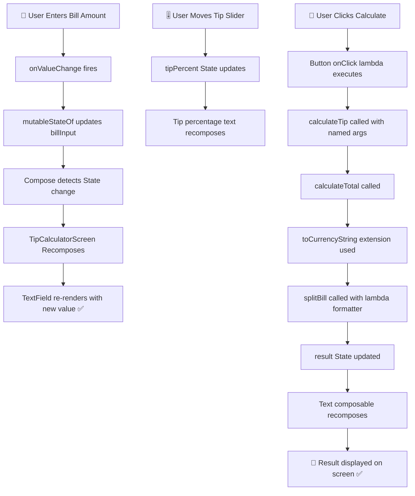
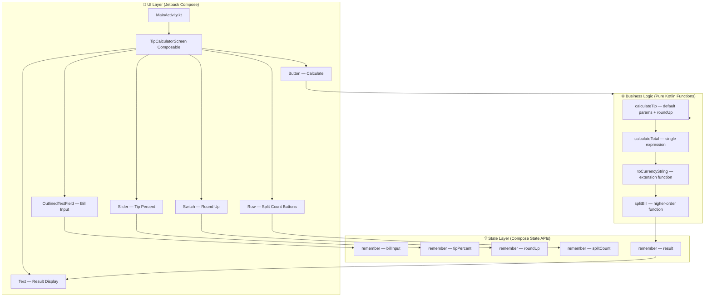
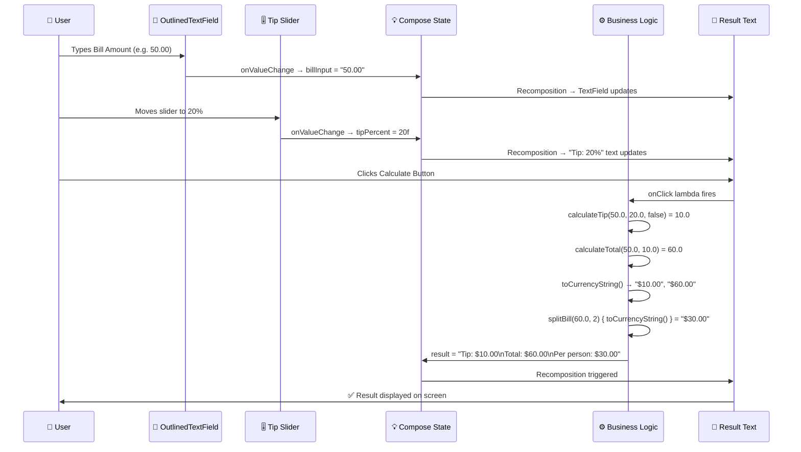
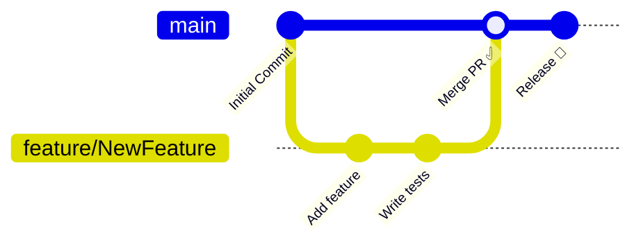

<div align="center">


<br/>

[](https://git.io/typing-svg)

<br/>

[](https://android.com)
[](https://kotlinlang.org)
[](https://developer.android.com/jetpack/compose)
[](https://m3.material.io)
[](LICENSE)

<br/>

> 🧮 **Tip Calculator** is a clean, minimal Android app that calculates tips,
> totals, and per-person splits instantly — built with **Jetpack Compose**,
> **Material 3**, and showcases core **Kotlin function concepts**.

<br/>

[📥 Download App](#-download) • [🚀 Getting Started](#-getting-started) • [✨ Features](#-features) • [📚 Key Concepts](#-key-concepts-learned) • [🏗️ Architecture](#-architecture) • [🤝 Contributing](#-contributing)

</div>

---

## 📖 Table of Contents

- [🌟 About](#-about)
- [📥 Download](#-download)
- [📸 Screenshots](#-screenshots)
- [✨ Features](#-features)
- [📚 Key Concepts Learned](#-key-concepts-learned)
- [🛠️ Tech Stack](#-tech-stack)
- [🏗️ Architecture](#-architecture)
- [🚀 Getting Started](#-getting-started)
- [🧪 Running Tests](#-running-tests)
- [📁 Project Structure](#-project-structure)
- [🗺️ Roadmap](#-roadmap)
- [🤝 Contributing](#-contributing)
- [📄 License](#-license)
- [📬 Contact](#-contact)

---

## 🌟 About

**Tip Calculator** is a minimal yet powerful Android app that lets you:
- Enter any **bill amount**
- Adjust **tip percentage** via a smooth slider (0% – 30%)
- **Round up** the tip with a single toggle
- **Split the bill** among any number of people

It is built as a **hands-on Kotlin learning project** demonstrating:

- 🧩 **Jetpack Compose** for declarative UI — no XML layouts
- 💡 **Compose State APIs** (`remember`, `mutableStateOf`) for reactive updates
- 🎨 **Material 3** theming with `OutlinedTextField`, `Slider`, `Switch`, and `Button`
- 🔧 **Core Kotlin Function Concepts** — default parameters, extension functions,
  single-expression functions, higher-order functions, and named arguments

### 🎯 Who Is This For?

| Audience | Benefit |
|---|---|
| 👶 Android Beginners | A clean reference for Compose State management |
| 🧩 Kotlin Learners | Hands-on practice with advanced function features |
| 🎨 UI/UX Enthusiasts | Modern Material 3 components in action |
| 🔬 Compose Explorers | See recomposition and state flow work in practice |
| 🧪 Testers | Simple base to add unit and UI tests |

---

## 📥 Download

<div align="center">

[](https://drive.google.com/file/d/1Jtbw0VTVEhi-lGhqVT4ZSExheS98Z65n/view?usp=sharing)
[](#)

</div>

---

## 📸 Screenshots

> 💡 A clean, minimal UI built entirely with Jetpack Compose and Material 3.

<div align="center">

<table>
  <tr>
    <td align="center"><b>Calculator Screen</b></td>
    <td align="center"><b>Result View</b></td>
  </tr>
  <tr>
    <td>
      
    </td>
    <td>
      
    </td>
  </tr>
</table>

</div>


---

## ✨ Features

<table>
  <tr>
    <td>🧩 <b>Modern Compose UI</b></td>
    <td>Built entirely with <b>Jetpack Compose</b> and <b>Material 3</b> — no XML layouts, pure declarative UI</td>
  </tr>
  <tr>
    <td>🎚️ <b>Tip Slider</b></td>
    <td>Smooth <b>0% to 30%</b> tip slider with real-time percentage display</td>
  </tr>
  <tr>
    <td>⬆️ <b>Round Up Toggle</b></td>
    <td>One-tap <b>Switch</b> to round up the tip to the nearest whole dollar</td>
  </tr>
  <tr>
    <td>👥 <b>Bill Splitter</b></td>
    <td>Split the total among <b>any number of people</b> using + / - buttons</td>
  </tr>
  <tr>
    <td>💰 <b>Instant Results</b></td>
    <td>Displays <b>Tip Amount</b>, <b>Total Bill</b>, and <b>Per Person cost</b> on one tap</td>
  </tr>
  <tr>
    <td>🔧 <b>Default Parameters</b></td>
    <td>Functions use smart defaults — <code>tipPercent = 15.0</code>, <code>roundUp = false</code></td>
  </tr>
  <tr>
    <td>🔗 <b>Extension Functions</b></td>
    <td><code>Double.toCurrencyString()</code> formats any number as <code>$XX.XX</code></td>
  </tr>
  <tr>
    <td>⚡ <b>Higher-Order Functions</b></td>
    <td><code>splitBill()</code> accepts a <b>lambda formatter</b> — clean and flexible design</td>
  </tr>
  <tr>
    <td>🏗️ <b>Single Activity Design</b></td>
    <td>Clean architecture with a single <code>MainActivity.kt</code> as the only entry point</td>
  </tr>
  <tr>
    <td>📦 <b>Lightweight & Fast</b></td>
    <td>Zero heavy external dependencies — just Compose and Material 3</td>
  </tr>
</table>

---

## 📚 Key Concepts Learned

> 💡 This project was built as a **hands-on Kotlin learning showcase**.
> Every function in the code teaches a specific Kotlin concept.

---

### 🔧 1. Functions with Default Parameters

```kotlin
fun calculateTip(
    billAmount: Double,
    tipPercent: Double = 15.0,  // default parameter
    roundUp: Boolean = false    // default parameter
): Double {
    var tip = billAmount * (tipPercent / 100.0)
    if (roundUp) {
        tip = kotlin.math.ceil(tip)
    }
    return tip
}
```

| Parameter | Default | Meaning |
|---|---|---|
| `tipPercent` | `15.0` | Standard tip if user doesn't specify |
| `roundUp` | `false` | No rounding unless explicitly requested |

> ✅ Default parameters remove the need for multiple overloaded functions.

---

### ⚡ 2. Single-Expression Function (One-Liner)

```kotlin
fun calculateTotal(bill: Double, tip: Double): Double = bill + tip
```

- No `{}` body needed — the result is the expression itself
- Cleaner, more readable for simple calculations
- Equivalent to writing `return bill + tip` in a full function body

---

### 🔗 3. Extension Function — Adds Method to Existing Class

```kotlin
fun Double.toCurrencyString(): String = "$${String.format("%.2f", this)}"
```

| Usage | Result |
|---|---|
| `25.5.toCurrencyString()` | `$25.50` |
| `100.0.toCurrencyString()` | `$100.00` |
| `0.333.toCurrencyString()` | `$0.33` |

> ✅ Extension functions let you add methods to existing types without modifying them.

---

### 🏗️ 4. Higher-Order Function — Function as Parameter

```kotlin
fun splitBill(
    total: Double,
    numberOfPeople: Int,
    formatter: (Double) -> String  // Lambda parameter
): String {
    val perPerson = total / numberOfPeople
    return formatter(perPerson)    // Call the passed function
}
```

**Usage with Lambda:**
```kotlin
val perPerson = splitBill(total, splitCount) { amount ->
    amount.toCurrencyString()  // extension function inside lambda
}
```

| Concept | What It Means |
|---|---|
| `(Double) -> String` | A function that takes a Double and returns a String |
| `{ amount -> ... }` | Lambda expression passed as the formatter argument |
| Flexibility | Caller decides how to format — function stays generic |

---

### 📝 5. Named Arguments — Clearer Function Calls

```kotlin
val tip = calculateTip(
    billAmount = bill,
    tipPercent = tipPercent.toDouble(),
    roundUp = roundUp
)
```

- Makes the call **self-documenting** — no need to check function signature
- **Order doesn't matter** when using named arguments
- Reduces bugs from accidentally swapping argument positions

---

### 🔄 6. Compose State — `remember` + `mutableStateOf`

```kotlin
var billInput   by remember { mutableStateOf("") }
var tipPercent  by remember { mutableStateOf(15f) }
var roundUp     by remember { mutableStateOf(false) }
var splitCount  by remember { mutableStateOf(1) }
var result      by remember { mutableStateOf("") }
```

| API | Role |
|---|---|
| `mutableStateOf()` | Creates a reactive state holder — UI auto-updates on change |
| `remember {}` | Keeps state alive across recompositions |
| `by` (delegation) | Write `tipPercent = 20f` instead of `tipPercent.value = 20f` |

```
User moves Slider
    → onValueChange fires
        → mutableStateOf updates tipPercent
            → Compose detects state change
                → UI recomposes automatically
                    → New percentage displayed ✅
```

---

### 🔁 7. Recomposition Flow — How It All Works Together


```mermaid
graph TD
    A[👤 User Enters Bill Amount] --> B[onValueChange fires]
    B --> C[mutableStateOf updates billInput]
    C --> D[Compose detects State change]
    D --> E[TipCalculatorScreen Recomposes]
    E --> F[TextField re-renders with new value ✅]

    G[🎚️ User Moves Tip Slider] --> H[tipPercent State updates]
    H --> I[Tip percentage text recomposes]

    J[🔘 User Clicks Calculate] --> K[Button onClick lambda executes]
    K --> L[calculateTip called with named args]
    L --> M[calculateTotal called]
    M --> N[toCurrencyString extension used]
    N --> O[splitBill called with lambda formatter]
    O --> P[result State updated]
    P --> Q[Text composable recomposes]
    Q --> R[🧮 Result displayed on screen ✅]
```

---

### 📊 8. Summary — All Concepts at a Glance

| # | Concept | Where Used in Code |
|---|---|---|
| 1 | Default Parameters | `calculateTip(tipPercent = 15.0, roundUp = false)` |
| 2 | Single-Expression Function | `fun calculateTotal(...): Double = bill + tip` |
| 3 | Extension Function | `fun Double.toCurrencyString()` |
| 4 | Higher-Order Function | `fun splitBill(..., formatter: (Double) -> String)` |
| 5 | Named Arguments | `calculateTip(billAmount = bill, tipPercent = ...)` |
| 6 | `remember` + `mutableStateOf` | All 5 state variables in `TipCalculatorScreen` |
| 7 | Lambda Expression | `splitBill(total, splitCount) { amount -> ... }` |
| 8 | Recomposition Flow | Auto UI refresh triggered by any state change |

---

## 🛠️ Tech Stack

<div align="center">

[](https://skillicons.dev)

</div>

<br/>

| Category | Technology | Purpose |
|---|---|---|
| 🔤 **Language** | Kotlin 1.9+ | Primary programming language |
| 🧩 **UI Framework** | Jetpack Compose | Declarative modern UI toolkit |
| 🎨 **Design System** | Material 3 | Components, theming & styling |
| 🔄 **State Management** | `remember` + `mutableStateOf` | Reactive UI without ViewModel |
| 🏗️ **Architecture** | Single Activity + Compose | Minimal, focused app structure |
| 🔨 **Build System** | Gradle (Kotlin DSL) | Build and dependency management |

---

## 🏗️ Architecture

Tip Calculator follows a **Compose-first single-activity architecture** — keeping
everything clean, minimal, and easy to follow.

### 🗂️ Architecture Diagram


```mermaid
graph TB
    subgraph UI["🧩 UI Layer (Jetpack Compose)"]
        MA[MainActivity.kt]
        TCS[TipCalculatorScreen Composable]
        TF[OutlinedTextField — Bill Input]
        SL[Slider — Tip Percent]
        SW[Switch — Round Up]
        ROW[Row — Split Count Buttons]
        BTN[Button — Calculate]
        TXT[Text — Result Display]
    end

    subgraph State["💡 State Layer (Compose State APIs)"]
        S1[remember — billInput]
        S2[remember — tipPercent]
        S3[remember — roundUp]
        S4[remember — splitCount]
        S5[remember — result]
    end

    subgraph Logic["⚙️ Business Logic (Pure Kotlin Functions)"]
        CT[calculateTip — default params + roundUp]
        CTT[calculateTotal — single expression]
        CS[toCurrencyString — extension function]
        SB[splitBill — higher-order function]
    end

    MA --> TCS
    TCS --> TF & SL & SW & ROW & BTN & TXT
    TF --> S1
    SL --> S2
    SW --> S3
    ROW --> S4
    BTN --> Logic
    Logic --> CT --> CTT --> CS --> SB
    SB --> S5
    S5 --> TXT
```

### 🔄 State Flow Diagram


```mermaid
sequenceDiagram
    participant User as 👤 User
    participant Input as 📝 OutlinedTextField
    participant Slider as 🎚️ Tip Slider
    participant State as 💡 Compose State
    participant Logic as ⚙️ Business Logic
    participant UI as 🧮 Result Text

    User->>Input: Types Bill Amount (e.g. 50.00)
    Input->>State: onValueChange → billInput = "50.00"
    State->>UI: Recomposition → TextField updates

    User->>Slider: Moves slider to 20%
    Slider->>State: onValueChange → tipPercent = 20f
    State->>UI: Recomposition → "Tip: 20%" text updates

    User->>UI: Clicks Calculate Button
    UI->>Logic: onClick lambda fires
    Logic->>Logic: calculateTip(50.0, 20.0, false) = 10.0
    Logic->>Logic: calculateTotal(50.0, 10.0) = 60.0
    Logic->>Logic: toCurrencyString() → "$10.00", "$60.00"
    Logic->>Logic: splitBill(60.0, 2) { toCurrencyString() } = "$30.00"
    Logic->>State: result = "Tip: $10.00\nTotal: $60.00\nPer person: $30.00"
    State->>UI: Recomposition triggered
    UI->>User: ✅ Result displayed on screen
```

### 📋 Layer Responsibilities

| Layer | Component | Responsibility |
|---|---|---|
| **UI** | `TipCalculatorScreen` | Renders all composables — input, slider, switch, buttons, result |
| **State** | `remember` + `mutableStateOf` | Holds all 5 reactive state variables |
| **Logic** | Pure Kotlin Functions | `calculateTip`, `calculateTotal`, `toCurrencyString`, `splitBill` |
| **Entry** | `MainActivity.kt` | Single entry point — sets `MaterialTheme` and calls the composable |

---

## 🚀 Getting Started

### Prerequisites

- ✅ Android Studio **Giraffe** or newer
- ✅ JDK **17+**
- ✅ Android device or emulator running **API 24+** (Android 7.0)
- ✅ Kotlin **1.9.0+**

### Installation

**1. Clone the repository**
```bash
git clone https://github.com/yourusername/TipCalculator.git
cd TipCalculator
```

**2. Open in Android Studio**
```
File → Open → Select the cloned TipCalculator folder
```

**3. Sync Gradle**
```bash
./gradlew build
```

**4. Run the App**
```bash
# Via terminal
./gradlew installDebug

# Or press Shift + F10 in Android Studio
```

> 💡 No API keys or external configurations needed — just clone and run!

---

## 🧪 Running Tests

```bash
# ✅ Run all Unit Tests
./gradlew test

# ✅ Run Instrumented UI Tests (requires connected device or emulator)
./gradlew connectedAndroidTest

# ✅ Run with verbose output for debugging
./gradlew test --info
```

| Test Type | Command | Source Location |
|---|---|---|
| Unit Tests | `./gradlew test` | `src/test/java/` |
| Instrumented Tests | `./gradlew connectedAndroidTest` | `src/androidTest/java/` |

---

## 📁 Project Structure

```
📁 com.apk.tipcalculator
│
├── 📁 ui/
│   └── 📁 theme/
│       ├── 🎨 Color.kt           # Light & Dark color palettes (Material 3)
│       ├── 📝 Typography.kt      # Font styles and text hierarchy
│       └── 🎨 Theme.kt           # App theme setup
│
├── 📄 MainActivity.kt            # 🚀 App entry point
│                                 #    ├── MaterialTheme setup
│                                 #    ├── TipCalculatorScreen() Composable
│                                 #    ├── calculateTip() — default parameters
│                                 #    ├── calculateTotal() — single-expression
│                                 #    ├── toCurrencyString() — extension function
│                                 #    └── splitBill() — higher-order function
│
├── 📄 ExampleUnitTest.kt         # 🧪 Local unit test verifications
└── 📄 ExampleInstrumentedTest.kt # 🤖 Instrumented UI tests
```

---

## 🗺️ Roadmap


```mermaid
graph LR
    subgraph DONE["✅ Completed"]
        A[Jetpack Compose UI]
        B[Tip Calculation Logic]
        C[Round Up Toggle]
        D[Bill Splitter]
        E[Material 3 Theming]
        F[Tip Slider 0-30%]
        G[Extension Functions]
        H[Higher-Order Functions]
    end

    subgraph WIP["🔄 In Progress"]
        I[Accessibility — TalkBack]
        J[UI Test Coverage]
    end

    subgraph PLAN["📋 Planned"]
        K[Dark / Light Mode Toggle]
        L[Tip History Log]
        M[Custom Tip % Input]
        N[Share Receipt as Image]
        O[Home Screen Widget]
        P[Play Store Release]
    end

    DONE --> WIP --> PLAN
```

| Status | Feature |
|---|---|
| ✅ Done | Jetpack Compose declarative UI |
| ✅ Done | Tip calculation with default parameters |
| ✅ Done | Round up tip toggle (Switch) |
| ✅ Done | Bill split among N people |
| ✅ Done | Material 3 theming |
| ✅ Done | Tip slider (0% – 30%) |
| ✅ Done | Extension function — `toCurrencyString()` |
| ✅ Done | Higher-order function — `splitBill()` |
| 🔄 In Progress | Enhanced accessibility — TalkBack support |
| 🔄 In Progress | Complete UI test coverage |
| 📋 Planned | Dark / Light mode manual toggle |
| 📋 Planned | Tip calculation history log |
| 📋 Planned | Custom tip percentage text input |
| 📋 Planned | Share receipt as a card image |
| 💡 Idea | Home screen widget |
| 💡 Idea | Google Play Store release |

---

## 🤝 Contributing

Contributions are **always welcome**! 🌟


```mermaid
gitGraph
    commit id: "Initial Commit"
    branch feature/NewFeature
    checkout feature/NewFeature
    commit id: "Add feature"
    commit id: "Write tests"
    checkout main
    merge feature/NewFeature id: "Merge PR ✅"
    commit id: "Release 🚀"
```

**Steps to Contribute:**

1. **Fork** the project
2. **Create** your feature branch
   ```bash
   git checkout -b feature/AmazingFeature
   ```
3. **Commit** your changes using Conventional Commits
   ```bash
   git commit -m "feat: add tip history log"
   ```
4. **Push** to your branch
   ```bash
   git push origin feature/AmazingFeature
   ```
5. **Open** a Pull Request 🎉

### 📋 Commit Convention

| Prefix | Purpose | Example |
|---|---|---|
| `feat:` | New feature | `feat: add custom tip input` |
| `fix:` | Bug fix | `fix: incorrect split on decimal amounts` |
| `refactor:` | Code refactor | `refactor: extract tip logic to ViewModel` |
| `test:` | Add/update tests | `test: add unit test for calculateTip` |
| `docs:` | Documentation | `docs: update README key concepts` |
| `chore:` | Config/build changes | `chore: update gradle version` |
| `style:` | UI tweaks | `style: update button corner radius` |

### 📋 Contribution Guidelines

- Follow **Kotlin coding conventions** throughout
- Write **unit tests** for any new logic added
- Keep Composables **small, focused and reusable**
- Follow **Material 3** guidelines for UI changes
- Update **README** for any structural or feature changes
- Use **conventional commits** for all commit messages

---

## 📄 License

Distributed under the **MIT License**. See [`LICENSE`](LICENSE) for full details.

```
MIT License

Copyright (c) 2026 Atanu Biswas

Permission is hereby granted, free of charge, to any person obtaining a copy
of this software and associated documentation files (the "Software"), to deal
in the Software without restriction, including without limitation the rights
to use, copy, modify, merge, publish, distribute, sublicense, and/or sell
copies of the Software, and to permit persons to whom the Software is
furnished to do so, subject to the following conditions:

The above copyright notice and this permission notice shall be included in
all copies or substantial portions of the Software.
```

---

## 📬 Contact

<div align="center">

**Atanu Biswas**

[](https://github.com/atanucsejgec)
[](https://github.com/atanucsejgec/Tip_Calculator)

🌟 **Project Link:** [https://github.com/yourusername/TipCalculator](https://github.com/atanucsejgec/Tip_Calculator)

</div>

---

<div align="center">

### ⭐ If Tip Calculator helped you learn Kotlin, please drop a Star — it really means a lot! ⭐


</div>
