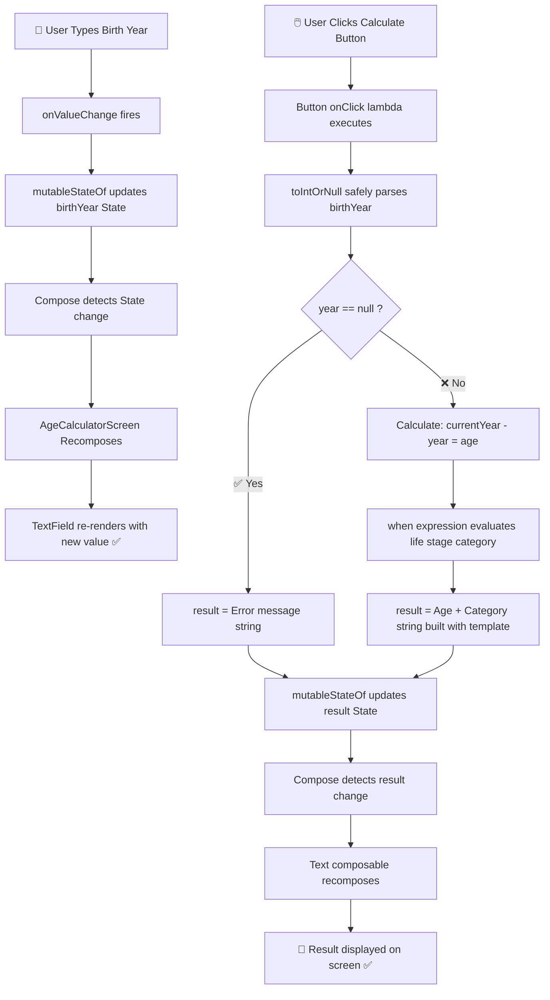
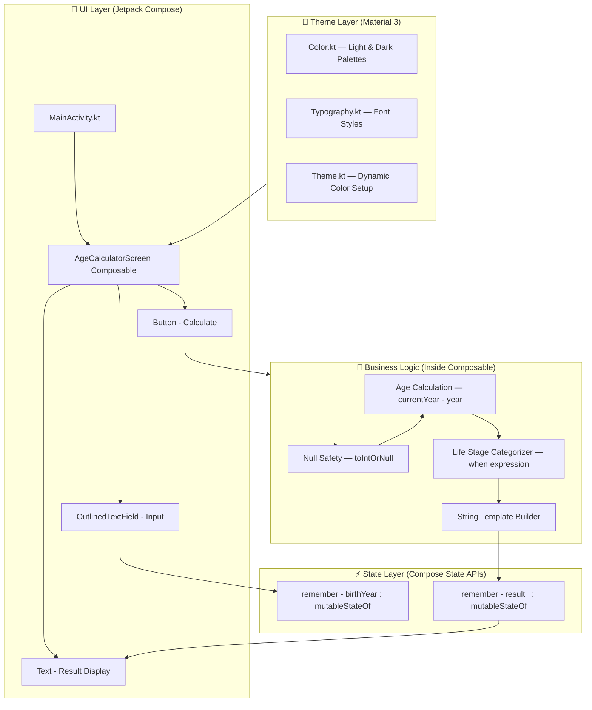
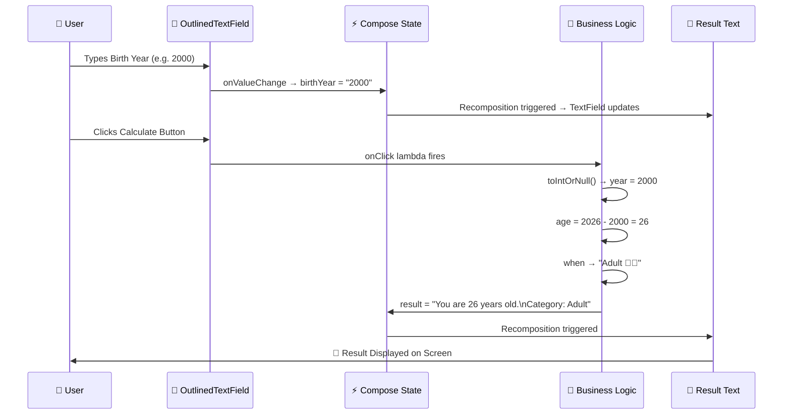
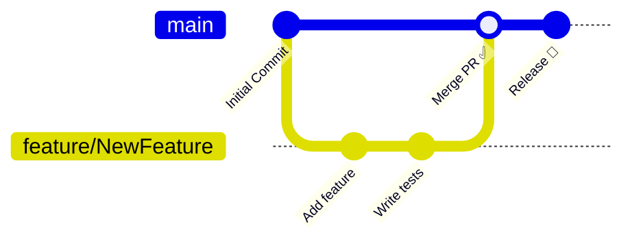

<div align="center">


<br/>

[](https://git.io/typing-svg)

<br/>

[](https://android.com)
[](https://kotlinlang.org)
[](https://developer.android.com/jetpack/compose)
[](https://m3.material.io)
[](LICENSE)
[](https://github.com/atanucsejgec/AgeCalculator/stargazers)
[](https://github.com/atanucsejgec/AgeCalculator/issues)
[](https://github.com/atanucsejgec/AgeCalculator/commits)

<br/>

> 🎂 **Age Calculator** is a beautifully crafted Android app that calculates your exact age
> and intelligently categorizes your life stage — built with **Jetpack Compose**,
> **Material 3**, and core modern Android practices.

<br/>

[📲 Download App](#-download) • [🚀 Getting Started](#️-getting-started) • [✨ Features](#-features) • [📚 Key Concepts](#-key-concepts-learned) • [🏗️ Architecture](#️-architecture) • [🤝 Contribute](#-contributing)

</div>

---

## 📖 Table of Contents

- [📌 About](#-about)
- [📲 Download](#-download)
- [📸 Screenshots](#-screenshots)
- [✨ Features](#-features)
- [📚 Key Concepts Learned](#-key-concepts-learned)
- [🛠️ Tech Stack](#️-tech-stack)
- [🏗️ Architecture](#️-architecture)
- [⚙️ Getting Started](#️-getting-started)
- [🧪 Running Tests](#-running-tests)
- [📦 Project Structure](#-project-structure)
- [🗺️ Roadmap](#️-roadmap)
- [🤝 Contributing](#-contributing)
- [👥 Contributors](#-contributors)
- [📄 License](#-license)
- [📬 Contact](#-contact)

---

## 📌 About

**Age Calculator** is a minimal yet powerful Android app that takes your **birth year**
as input and instantly calculates your **current age**. It further classifies users into
meaningful **life stages** — Child, Teenager, Adult, or Senior — using smart logic
baked right into the UI layer.

This project is a **showcase of modern Android development** using:

- 🎨 **Jetpack Compose** for declarative UI
- 💡 **Compose State APIs** (`remember`, `mutableStateOf`) for reactive updates
- 🎭 **Material 3** dynamic theming with seamless Dark/Light mode transitions
- 🏛️ **Single Activity Architecture** with a clean and focused codebase
- 🔤 **Core Kotlin Concepts** like `val`/`var`, `when`, nullable types & string templates

### 🎯 Who Is This For?

| Audience | Benefit |
|---|---|
| 👶 Android Beginners | A clean reference for Compose `State` management |
| 🎨 UI/UX Enthusiasts | Modern Material 3 theming with dynamic colors |
| 📚 Kotlin Learners | Explore `var`, `val`, `when`, nullable types hands-on |
| 🧪 Testers | JUnit & AndroidJUnit4 test examples included |
| 🚀 Compose Explorers | See how recomposition & state flow work in practice |

---

## 📲 Download

<div align="center">

[](https://drive.google.com/file/d/1jwmMxkt5q4jdXDLQLFzPxdOONr_YZYFg/view?usp=sharing)
[](#)


</div>

---

## 📸 Screenshots

> 💡 A clean, minimal UI built entirely with Jetpack Compose and Material 3.

<div align="center">

<table>
  <tr>
    <td align="center"><b>🌞 Home (Light Mode)</b></td>
    <td align="center"><b>🌙 Home (Dark Mode)</b></td>
  </tr>
  <tr>
    <td>
      
    </td>
    <td>
      
    </td>
  </tr>
</table>

</div>

---

## ✨ Features

<table>
  <tr>
    <td>🎨 <b>Modern Compose UI</b></td>
    <td>Built entirely with <b>Jetpack Compose</b> and <b>Material 3</b> — no XML layouts, pure declarative UI</td>
  </tr>
  <tr>
    <td>🌙 <b>Dynamic Theming</b></td>
    <td>Full support for <b>Dark & Light mode</b> with Android 12+ dynamic color (Monet) integration</td>
  </tr>
  <tr>
    <td>🧮 <b>Instant Age Calculation</b></td>
    <td>Type your birth year and get your <b>real-time age</b> displayed instantly on button press</td>
  </tr>
  <tr>
    <td>📊 <b>Smart Life Stage Detection</b></td>
    <td>Automatically categorizes you as <b>Child 👶</b>, <b>Teenager 🧑</b>, <b>Adult 💼</b>, or <b>Senior 👴</b></td>
  </tr>
  <tr>
    <td>⚡ <b>Reactive State Management</b></td>
    <td>Uses Compose's <code>remember</code> + <code>mutableStateOf</code> for seamless, boilerplate-free UI reactivity</td>
  </tr>
  <tr>
    <td>🛡️ <b>Safe Input Handling</b></td>
    <td>Uses <code>toIntOrNull()</code> to safely parse input — no crashes on invalid text entry</td>
  </tr>
  <tr>
    <td>🏛️ <b>Single Activity Design</b></td>
    <td>Clean architecture with a single <code>MainActivity.kt</code> as the only entry point</td>
  </tr>
  <tr>
    <td>♿ <b>Accessibility Ready</b></td>
    <td>Semantic descriptions and content labels for TalkBack and screen reader support</td>
  </tr>
  <tr>
    <td>📦 <b>Lightweight & Fast</b></td>
    <td>Minimal APK size with zero heavy external dependencies — just Compose and Material 3</td>
  </tr>
</table>

---

## 📚 Key Concepts Learned

> 💡 This project was built as a **hands-on learning experience** with Kotlin & Jetpack Compose.
> Here are the core concepts explored and applied through this app:

---

### 🔤 1. Kotlin Variables — `var` vs `val`

```kotlin
val currentYear = 2026   // ✅ Immutable — cannot be reassigned
var birthYear   = ""     // ✅ Mutable   — can be reassigned anytime
```

| Keyword | Mutable? | Use Case |
|---------|----------|----------|
| `val` | ❌ No | Constants, fixed values that never change |
| `var` | ✅ Yes | Values that change during runtime |

> 💡 Use `val` by default. Switch to `var` only when you **need** to reassign.

---

### 🧠 2. Compose State — `remember` + `mutableStateOf`

```kotlin
var birthYear by remember { mutableStateOf("") }
var result    by remember { mutableStateOf("") }
```

| API | Role |
|-----|------|
| `mutableStateOf()` | Creates a **reactive state** holder — UI auto-updates when value changes |
| `remember {}` | Keeps state **alive across recompositions** — prevents reset on every redraw |
| `by` (delegation) | Lets you write `birthYear = "2000"` instead of `birthYear.value = "2000"` |

```
User types in TextField
    → onValueChange fires
        → mutableStateOf updates birthYear
            → Compose detects state change
                → UI recomposes automatically
                    → New value displayed ✅
```

---

### ❓ 3. Nullable Types & Safe Parsing — `Int?` and `toIntOrNull()`

```kotlin
val year: Int? = birthYear.toIntOrNull()
```

- `Int?` → A **nullable integer** — can hold an `Int` value OR `null`
- `toIntOrNull()` → Safely converts a `String` to `Int`.
  Returns `null` if parsing fails (e.g. `"abc"`, `""`)
- Prevents **NumberFormatException** crashes at runtime

| Input String | `toIntOrNull()` Result |
|---|---|
| `"2000"` | `2000` ✅ |
| `"abc"` | `null` ⚠️ |
| `""` (empty) | `null` ⚠️ |
| `"20.5"` | `null` ⚠️ |

---

### 🔀 4. `if / else` as an Expression

```kotlin
result = if (year == null) {
    "Please enter a valid number"
} else {
    "You are $age years old."
}
```

> 💡 In Kotlin, `if/else` is an **expression** — it returns a value directly.
> No need for a ternary operator like Java's `condition ? a : b`.

| Language | Conditional Assignment |
|---|---|
| ☕ Java | `String r = (x == null) ? "No" : "Yes";` |
| 🎯 Kotlin | `val r = if (x == null) "No" else "Yes"` |

---

### 🔁 5. `when` Expression — Kotlin's Smart `switch`

```kotlin
val category: String = when {
    age < 0  -> "Not born yet! 🤔"
    age < 13 -> "Child 👶"
    age < 18 -> "Teenager 🧑"
    age < 60 -> "Adult 🧑‍💼"
    else     -> "Senior 👴"
}
```

- `when` without an argument works like a **chain of if-else conditions**
- Each condition is checked **top to bottom** — first match wins
- `else` acts as the **default fallback** (like `default` in Java's switch)
- Returns a value directly — assigned straight to `category`

| Age Range | Category Output |
|---|---|
| `age < 0` | Not born yet! 🤔 |
| `0 – 12` | Child 👶 |
| `13 – 17` | Teenager 🧑 |
| `18 – 59` | Adult 🧑‍💼 |
| `60+` | Senior 👴 |

---

### 💬 6. String Templates

```kotlin
"You are $age years old.\nCategory: $category"
```

| Syntax | Use Case | Example |
|--------|----------|---------|
| `$variable` | Embed a variable directly | `"Hello $name"` |
| `${expression}` | Embed any Kotlin expression | `"Age: ${2026 - year}"` |
| `\n` | Insert a new line in the string | `"Line1\nLine2"` |

> 💡 String templates are cleaner and safer than Java's `"Hello " + name + "!"` concatenation.

---

### 🎨 7. Jetpack Compose UI Basics

```kotlin
@Composable
fun AgeCalculatorScreen() { ... }
```

| Composable / Concept | What It Does |
|---|---|
| `@Composable` | Marks a function as a UI building block for Compose |
| `MaterialTheme {}` | Wraps the app with Material 3 color, shape & typography |
| `Column {}` | Arranges children **vertically** in a stack |
| `Spacer(Modifier.height())` | Adds blank vertical space between composables |
| `OutlinedTextField` | Material 3 styled bordered text input field |
| `Button { onClick = {} }` | Tappable button — runs a lambda when clicked |
| `Text("...")` | Renders a string as visible text on screen |
| `Modifier` | Applies layout rules: padding, size, alignment, etc. |
| `Alignment.CenterHorizontally` | Centers children horizontally inside a `Column` |
| `Arrangement.Center` | Centers children vertically inside a `Column` |

---

### 🔄 8. Recomposition Flow — How It All Works Together


```mermaid
graph TD
    A[👤 User Types Birth Year] --> B[onValueChange fires]
    B --> C[mutableStateOf updates birthYear State]
    C --> D[Compose detects State change]
    D --> E[AgeCalculatorScreen Recomposes]
    E --> F[TextField re-renders with new value ✅]

    G[🖱️ User Clicks Calculate Button] --> H[Button onClick lambda executes]
    H --> I[toIntOrNull safely parses birthYear]
    I --> J{year == null ?}
    J -- ✅ Yes --> K[result = Error message string]
    J -- ❌ No --> L[Calculate: currentYear - year = age]
    L --> M[when expression evaluates life stage category]
    M --> N[result = Age + Category string built with template]
    K --> O[mutableStateOf updates result State]
    N --> O
    O --> P[Compose detects result change]
    P --> Q[Text composable recomposes]
    Q --> R[🎂 Result displayed on screen ✅]
```

---

### 🗂️ Summary — All Concepts at a Glance

| # | Concept | Where Used in Code |
|---|---------|-------------------|
| 1 | `val` vs `var` | `val currentYear = 2026`, `var birthYear` |
| 2 | `remember` + `mutableStateOf` | State for `birthYear` and `result` variables |
| 3 | Nullable `Int?` + `toIntOrNull()` | Safely parsing user text input |
| 4 | `if/else` as expression | Assigning `result` based on null check |
| 5 | `when` expression | Categorizing age into life stage labels |
| 6 | String Templates `$` `${}` `\n` | Building the formatted output result string |
| 7 | Jetpack Compose Composables | Entire UI built with `@Composable` functions |
| 8 | Recomposition Flow | Auto UI refresh triggered by state changes |

---

## 🛠️ Tech Stack

<div align="center">

[](https://skillicons.dev)

</div>

<br/>

| Category | Technology | Purpose |
|---|---|---|
| 🌐 **Language** | Kotlin 1.9+ | Primary programming language |
| 🎨 **UI Framework** | Jetpack Compose | Declarative modern UI toolkit |
| 🖌️ **Design System** | Material 3 | Components, theming & dynamic color |
| 🧠 **State Management** | `remember` + `mutableStateOf` | Reactive UI without ViewModel overhead |
| 🏛️ **Architecture** | Single Activity + Compose | Minimal, focused app structure |
| 🧪 **Unit Testing** | JUnit 4 | Local business logic tests |
| 🤖 **UI Testing** | AndroidJUnit4 | Instrumented Compose UI tests |
| 🔧 **Build System** | Gradle (Kotlin DSL) | Build and dependency automation |

---

## 🏗️ Architecture

Age Calculator follows a **streamlined Compose-first architecture**, keeping things
simple and focused — ideal for a lightweight utility app.

### 📐 Architecture Diagram


```mermaid
graph TB
    subgraph UI["🎨 UI Layer (Jetpack Compose)"]
        MA[MainActivity.kt]
        ACS[AgeCalculatorScreen Composable]
        TF[OutlinedTextField - Input]
        BTN[Button - Calculate]
        TXT[Text - Result Display]
    end

    subgraph State["⚡ State Layer (Compose State APIs)"]
        BS[remember - birthYear : mutableStateOf]
        RS[remember - result   : mutableStateOf]
    end

    subgraph Logic["🧮 Business Logic (Inside Composable)"]
        AL[Age Calculation — currentYear - year]
        NP[Null Safety — toIntOrNull]
        LC[Life Stage Categorizer — when expression]
        ST[String Template Builder]
    end

    subgraph Theme["🎨 Theme Layer (Material 3)"]
        CT[Color.kt — Light & Dark Palettes]
        TY[Typography.kt — Font Styles]
        TH[Theme.kt — Dynamic Color Setup]
    end

    MA --> ACS
    ACS --> TF & BTN & TXT
    TF --> BS
    BTN --> Logic
    Logic --> NP --> AL --> LC --> ST
    ST --> RS
    RS --> TXT
    Theme --> ACS
```

### 🔄 State Flow Diagram


```mermaid
sequenceDiagram
    participant User as 👤 User
    participant Input as 📝 OutlinedTextField
    participant State as ⚡ Compose State
    participant Logic as 🧮 Business Logic
    participant UI as 🎨 Result Text

    User->>Input: Types Birth Year (e.g. 2000)
    Input->>State: onValueChange → birthYear = "2000"
    State->>UI: Recomposition triggered → TextField updates

    User->>Input: Clicks Calculate Button
    Input->>Logic: onClick lambda fires
    Logic->>Logic: toIntOrNull() → year = 2000
    Logic->>Logic: age = 2026 - 2000 = 26
    Logic->>Logic: when → "Adult 🧑‍💼"
    Logic->>State: result = "You are 26 years old.\nCategory: Adult"
    State->>UI: Recomposition triggered
    UI->>User: 🎂 Result Displayed on Screen
```

### 🧱 Layer Responsibilities

| Layer | Component | Responsibility |
|---|---|---|
| **UI** | `AgeCalculatorScreen` | Renders all composables — input, button, result |
| **State** | `remember` + `mutableStateOf` | Holds `birthYear` and `result` reactively |
| **Logic** | Inside `Button onClick` | Parses year, calculates age, categorizes stage |
| **Theme** | `ui/theme/` | Material 3 color, typography & dynamic color |

---

## ⚙️ Getting Started

### Prerequisites

- ✅ Android Studio **Giraffe** or newer
- ✅ JDK **17+**
- ✅ Android device or emulator running **API 24+** (Android 7.0)
- ✅ Kotlin **1.9.0+**

### Installation

**1. Clone the repository**

```bash
git clone https://github.com/atanucsejgec/AgeCalculator.git
cd AgeCalculator
```

**2. Open in Android Studio**

```
File → Open → Select the cloned AgeCalculator folder
```

**3. Sync Gradle**

```bash
./gradlew build
```

**4. Run the App**

```bash
# Via terminal
./gradlew installDebug

# Or press Shift + F10 in Android Studio
```

> 💡 No API keys or external configurations needed — just clone and run!

---

## 🧪 Running Tests

```bash
# ✅ Run all Unit Tests
./gradlew test

# ✅ Run Instrumented UI Tests (requires connected device or emulator)
./gradlew connectedAndroidTest

# ✅ Run with verbose output for debugging
./gradlew test --info
```

| Test Type | Command | Source Location |
|---|---|---|
| Unit Tests | `./gradlew test` | `src/test/java/` |
| Instrumented Tests | `./gradlew connectedAndroidTest` | `src/androidTest/java/` |

---

## 📦 Project Structure

```
📦 com.apk.agecalculator
│
├── 📂 ui/
│   └── 📂 theme/
│       ├── 🎨 Color.kt           # Light & Dark color palettes (Material 3)
│       ├── 🔤 Typography.kt      # Font styles and text hierarchy
│       └── 🖌️ Theme.kt           # App theme + dynamic color (Android 12+)
│
├── 📄 MainActivity.kt            # 🏠 App entry point
│                                 #    ├── setContent { MaterialTheme }
│                                 #    ├── AgeCalculatorScreen() Composable
│                                 #    ├── remember + mutableStateOf (State)
│                                 #    ├── Age calculation logic
│                                 #    ├── toIntOrNull() safe parsing
│                                 #    ├── when expression (life stage)
│                                 #    └── String template result builder
│
├── 📄 ExampleUnitTest.kt         # 🧪 Local unit test verifications
└── 📄 ExampleInstrumentedTest.kt # 🤖 Instrumented UI tests
```

---

## 🗺️ Roadmap


```mermaid
graph LR
    subgraph DONE["✅ Completed"]
        A[Jetpack Compose UI]
        B[Age Calculation Logic]
        C[Life Stage Categorizer]
        D[Material 3 Theming]
        E[Dark and Light Mode]
        F[Dynamic Color Android 12+]
        G[Safe Input Parsing]
        H[String Template Output]
    end

    subgraph WIP["🔄 In Progress"]
        I[Accessibility Improvements]
        J[UI Test Coverage]
    end

    subgraph PLAN["📋 Planned"]
        K[Full Birth Date Picker]
        L[Exact Age - Days Months Years]
        M[Next Birthday Countdown]
        N[Age Sharing Card Feature]
        O[Home Screen Widget]
        P[Play Store Release]
    end

    DONE --> WIP --> PLAN
```

| Status | Feature |
|---|---|
| ✅ Done | Jetpack Compose declarative UI |
| ✅ Done | Instant age calculation from birth year input |
| ✅ Done | Smart life stage categorization via `when` |
| ✅ Done | Material 3 full theming system |
| ✅ Done | Dark / Light mode support |
| ✅ Done | Android 12+ Dynamic Color (Monet) |
| ✅ Done | Safe input parsing with `toIntOrNull()` |
| ✅ Done | String template formatted result output |
| 🔄 In Progress | Enhanced accessibility — TalkBack support |
| 🔄 In Progress | Complete UI test coverage |
| 📋 Planned | Full birth date picker (Day / Month / Year) |
| 📋 Planned | Exact age breakdown in Days, Months & Years |
| 📋 Planned | Next birthday countdown timer |
| 📋 Planned | Share your age card as an image |
| 💡 Idea | Home screen widget support |
| 💡 Idea | Google Play Store release |

---

## 🤝 Contributing

Contributions are **always welcome**! 🚀


```mermaid
gitGraph
   commit id: "Initial Commit"
   branch feature/NewFeature
   checkout feature/NewFeature
   commit id: "Add feature"
   commit id: "Write tests"
   checkout main
   merge feature/NewFeature id: "Merge PR ✅"
   commit id: "Release 🚀"
```

**Steps to Contribute:**

1. **Fork** the project

2. **Create** your feature branch
   ```bash
   git checkout -b feature/AmazingFeature
   ```

3. **Commit** your changes using Conventional Commits
   ```bash
   git commit -m "feat: add amazing feature"
   ```

4. **Push** to your branch
   ```bash
   git push origin feature/AmazingFeature
   ```

5. **Open** a Pull Request 🎉

### 📋 Commit Convention

| Prefix | Purpose | Example |
|---|---|---|
| `feat:` | New feature | `feat: add birthday countdown` |
| `fix:` | Bug fix | `fix: incorrect age on leap year` |
| `refactor:` | Code refactor | `refactor: extract life stage logic` |
| `test:` | Add/update tests | `test: add unit test for age calc` |
| `docs:` | Documentation update | `docs: update README key concepts` |
| `chore:` | Config or build changes | `chore: update gradle version` |
| `style:` | UI or styling tweaks | `style: update card corner radius` |

### 📋 Contribution Guidelines

- Follow **Kotlin coding conventions** throughout
- Write **unit tests** for any new logic added
- Keep Composables **small, focused and reusable**
- Follow **Material 3** guidelines for any UI changes
- Update **README** for any structural or feature changes
- Use **conventional commits** for all commit messages

---

## 👥 Contributors

<div align="center">

[](https://github.com/atanucsejgec/AgeCalculator/graphs/contributors)

*Made with [contrib.rocks](https://contrib.rocks)*

</div>

---

## 📄 License

Distributed under the **MIT License**. See [`LICENSE`](LICENSE) for full details.

```
MIT License

Copyright (c) 2024 Atanu Biswas

Permission is hereby granted, free of charge, to any person obtaining a copy
of this software and associated documentation files (the "Software"), to deal
in the Software without restriction, including without limitation the rights
to use, copy, modify, merge, publish, distribute, sublicense, and/or sell
copies of the Software, and to permit persons to whom the Software is
furnished to do so, subject to the following conditions:

The above copyright notice and this permission notice shall be included in
all copies or substantial portions of the Software.
```

---

## 📬 Contact

<div align="center">

**Atanu Biswas**

[](https://github.com/atanucsejgec)
[](https://github.com/atanucsejgec/AgeCalculator)

📌 **Project Link:** [https://github.com/atanucsejgec/AgeCalculator](https://github.com/atanucsejgec/AgeCalculator)

</div>

---

<div align="center">

### ⭐ If Age Calculator made you smile, please drop a Star — it really means a lot! ⭐


</div>
