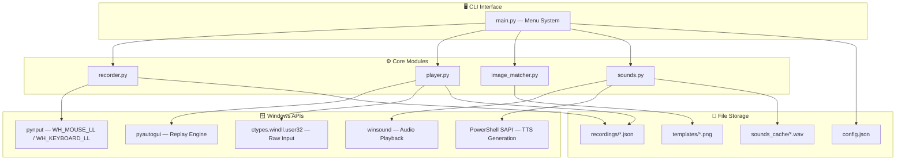
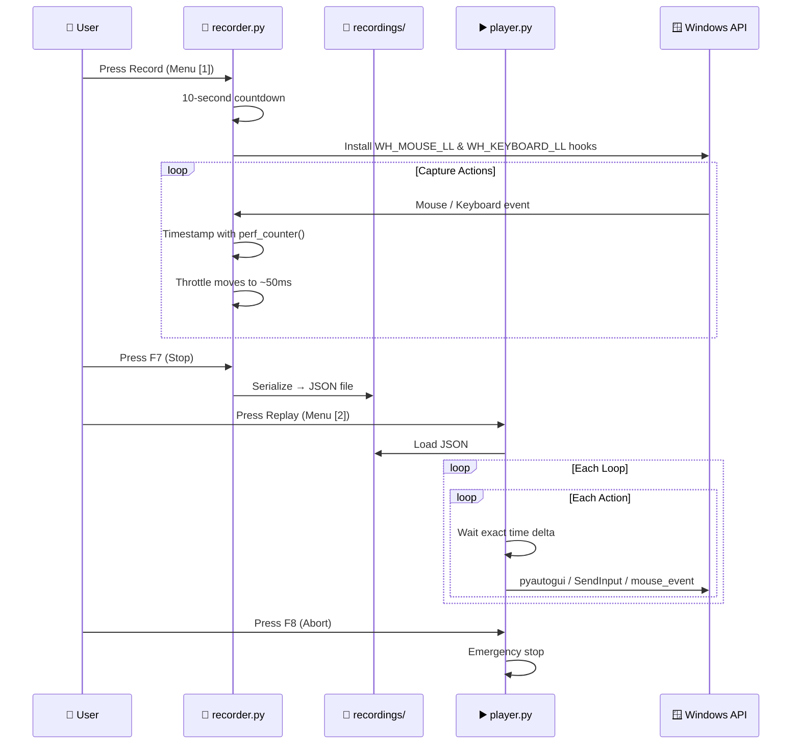
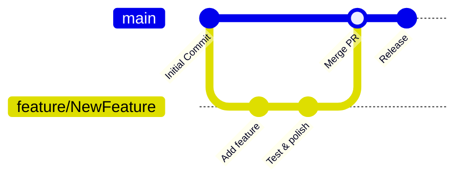

<div align="center">


<br/>

[](https://git.io/typing-svg)

<br/>

[](https://www.python.org/)
[](https://www.microsoft.com/windows)
[](https://opencv.org/)
[](https://pyautogui.readthedocs.io/)
[](https://pynput.readthedocs.io/)
[](LICENSE)
[](https://github.com/atanucsejgec/Automation_Bot/stargazers)
[](https://github.com/atanucsejgec/Automation_Bot/issues)
[](https://github.com/atanucsejgec/Automation_Bot/commits)

<br/>

> 🤖 **AutoPilot** is a powerful desktop automation suite that records your mouse and keyboard actions, then replays them with precise timing. It works with **any** application — browsers, games, productivity tools, or any software running on your Windows desktop.

<br/>

[🚀 Quick Start](#-quick-start) • [✨ Features](#-features) • [🏗️ Architecture](#️-architecture) • [⚙️ Installation](#️-installation) • [📖 Usage Guide](#-usage-guide) • [🤝 Contributing](#-contributing)

</div>

---

## 📖 Table of Contents

- [📌 About](#-about)
- [✨ Features](#-features)
- [🖥️ Platform Support](#️-platform-support)
- [📦 Requirements](#-requirements)
- [⚙️ Installation](#️-installation)
- [🚀 Quick Start](#-quick-start)
- [📖 Usage Guide](#-usage-guide)
- [🔧 Configuration Reference](#-configuration-reference)
- [⌨️ Hotkeys](#️-hotkeys)
- [🏗️ Architecture](#️-architecture)
- [⚠️ Known Limitations](#️-known-limitations)
- [🩺 Troubleshooting](#-troubleshooting)
- [🤝 Contributing](#-contributing)
- [📄 License](#-license)

---

## 📌 About

**AutoPilot** is a desktop automation tool built for Windows that captures every mouse click, movement, scroll, and keypress — then replays them with exact timing. Whether you want to automate repetitive browser tasks, grind in a game, or test a desktop application, AutoPilot handles it all with a clean, professional CLI interface.

### 🎯 Why AutoPilot?

<table>
  <tr>
    <td align="center">🎯</td>
    <td><b>Universal Compatibility</b></td>
    <td>Works with <i>any</i> application running on your desktop — browsers, games, productivity tools, IDEs, anything.</td>
  </tr>
  <tr>
    <td align="center">⏱️</td>
    <td><b>Precise Timing</b></td>
    <td>Replays actions with microsecond-accurate timing using <code>time.perf_counter()</code> — not just approximate delays.</td>
  </tr>
  <tr>
    <td align="center">🔁</td>
    <td><b>Smart Loop Automation</b></td>
    <td>Run recordings in a loop with configurable count, delay, and ±5% jitter for anti-detection shuffle mode.</td>
  </tr>
  <tr>
    <td align="center">🖱️</td>
    <td><b>Raw Scroll Precision</b></td>
    <td>Captures and replays scroll with raw Win32 WHEEL_DELTA values — not lossy normalized units.</td>
  </tr>
  <tr>
    <td align="center">🔊</td>
    <td><b>Audio Feedback</b></td>
    <td>Text-to-speech announcements for recording start/stop and loop events so you never miss a state change.</td>
  </tr>
  <tr>
    <td align="center">🛑</td>
    <td><b>Emergency Abort</b></td>
    <td>Press <b>F8</b> at any time to instantly stop replay — you're always in control.</td>
  </tr>
  <tr>
    <td align="center">📸</td>
    <td><b>Visual Detection</b></td>
    <td>OpenCV-powered template matching finds buttons and UI elements on screen with configurable confidence thresholds.</td>
  </tr>
  <tr>
    <td align="center">🖥️</td>
    <td><b>Clean CLI Interface</b></td>
    <td>Professional boxed-art terminal interface with progress indicators — no GUI bloat, just speed.</td>
  </tr>
</table>

---

## ✨ Features

<table>
  <tr>
    <td>🖱️ <b>Action Recording</b></td>
    <td>Captures mouse clicks, movement, scrolling, and full keyboard input including modifiers (Ctrl, Shift, Alt) and key combinations</td>
  </tr>
  <tr>
    <td>⏱️ <b>Precise Replay</b></td>
    <td>Replays actions with exact timing relative to the original recording using <code>time.perf_counter()</code></td>
  </tr>
  <tr>
    <td>🔁 <b>Loop Automation</b></td>
    <td>Run recordings in a loop with configurable count and configurable delay between loops</td>
  </tr>
  <tr>
    <td>🎲 <b>Shuffle Replay</b></td>
    <td>Randomly pick from multiple recordings each loop with ±5% timing jitter for anti-detection variation</td>
  </tr>
  <tr>
    <td>⚡ <b>Playback Speed</b></td>
    <td>Speed up or slow down replay with a multiplier (e.g., 2× speed, 0.5× speed)</td>
  </tr>
  <tr>
    <td>🛑 <b>Abort Hotkey</b></td>
    <td>Emergency stop during replay with a single key press (default: <b>F8</b>)</td>
  </tr>
  <tr>
    <td>🔊 <b>Sound Announcements</b></td>
    <td>Text-to-speech audio cues for recording start/stop and loop start/end events</td>
  </tr>
  <tr>
    <td>📜 <b>Scroll Shortcuts</b></td>
    <td>Ctrl+Up / Ctrl+Down to manually insert scroll events during recording — workaround for touchpad users</td>
  </tr>
  <tr>
    <td>📸 <b>Screenshot Capture</b></td>
    <td>Save screenshots for visual reference or use as template matching targets</td>
  </tr>
  <tr>
    <td>🔍 <b>Template Matching</b></td>
    <td>OpenCV-powered UI element detection — find buttons, icons, or any visual element on screen with configurable confidence</td>
  </tr>
  <tr>
    <td>🖥️ <b>Professional CLI</b></td>
    <td>Clean, boxed-art terminal interface with progress indicators and structured menus</td>
  </tr>
  <tr>
    <td>💾 <b>JSON Recording Format</b></td>
    <td>Recordings saved as human-readable JSON files with full metadata — easy to inspect, edit, or version-control</td>
  </tr>
</table>

---

## 🖥️ Platform Support

> ⚠️ **AutoPilot is currently Windows-only.**

| Component | Windows | macOS | Linux |
|---|:---:|:---:|:---:|
| Recording (mouse/keyboard) | ✅ | ❌ | ❌ |
| Replay (pyautogui) | ✅ | ⚠️ Partial | ⚠️ Partial |
| Sound Announcements | ✅ | ❌ | ❌ |
| Scroll Replay (raw delta) | ✅ | ❌ | ❌ |
| VK Code Keyboard Replay | ✅ | ❌ | ❌ |
| Window Focus/Management | ✅ | ❌ | ❌ |
| Template Matching (OpenCV) | ✅ | ✅ | ✅ |
| Screenshot Capture | ✅ | ✅ | ✅ |

### 🔍 Why Windows-Only?

The tool relies heavily on Windows-specific APIs:

| API Used | Purpose | Why It's Windows-Specific |
|---|---|---|
| `ctypes.windll.user32` | Window management, raw scroll replay, VK code keyboard input | Win32 API — no macOS/Linux equivalent |
| `winsound` | Play WAV audio announcements | Windows-only stdlib module |
| `PowerShell + System.Speech` | Generate text-to-speech WAV files | Windows .NET Framework only |
| `subprocess.CREATE_NO_WINDOW` | Silent PowerShell execution | Windows process creation flag |
| `pynput` (WH_MOUSE_LL hook) | Capture mouse/keyboard at OS level | Uses Windows low-level hooks |

**To port to macOS/Linux**, you would need to replace:

1. `winsound` → cross-platform audio library (e.g., `playsound`, `pygame.mixer`)
2. `System.Speech` TTS → `pyttsx3` or `gTTS`
3. `ctypes.windll.user32` calls → platform-specific equivalents
4. `SendInput` / `mouse_event` → `pyautogui` equivalents (losing some precision)
5. Remove `subprocess.CREATE_NO_WINDOW` flag

---

## 📦 Requirements

- **OS**: Windows 10 / 11 (64-bit)
- **Python**: 3.10 or higher

| Package | Version | Purpose |
|---|---|---|
| `pyautogui` | ≥ 0.9.54 | Mouse/keyboard replay automation |
| `pynput` | ≥ 1.7.6 | Low-level input capture (recording) |
| `opencv-python` | ≥ 4.8.0 | Template matching & screenshot processing |
| `numpy` | ≥ 1.24.0 | Array operations for OpenCV |

---

## ⚙️ Installation

**1. Clone the repository**

```bash
git clone https://github.com/atanucsejgec/Automation_Bot.git
cd Automation_Bot
```

**2. Install Python dependencies**

```bash
pip install -r requirements.txt
```

**3. Run the application**

```bash
python main.py
```

> **💡 Note:** On first run with sound enabled, AutoPilot will generate WAV audio files using Windows text-to-speech. This is a one-time setup that takes a few seconds.

---

## 🚀 Quick Start

```
1. Run:       python main.py
2. Select:    [1] New Recording
3. Name it:   my_workflow  (or press Enter for auto-name)
4. Wait:      10-second countdown — switch to your target app
5. Perform:   Your mouse/keyboard actions
6. Stop:      Press F7
7. Replay:    Select [2] → choose recording → set loops → go!
8. Emergency: Press F8 to abort replay at any time
```

---

## 📖 Usage Guide

### 1. 🔴 Recording

```
Select [1] from the main menu
```

1. Enter a name for your recording (or press Enter for an auto-generated timestamp name)
2. A **10-second countdown** begins — switch to your target application
3. A sound plays: **"Recording started"**
4. Perform your actions — every mouse click, movement, scroll, and keypress is captured
5. Press **F7** to stop — a sound plays: **"Recording stopped"**
6. The recording is saved as a JSON file in the `recordings/` directory

**What gets recorded:**

| Action | Captured Data |
|---|---|
| Mouse click | Position (x, y), button (left/right/middle), press/release |
| Mouse move | Position (x, y), throttled to ~50ms intervals |
| Mouse scroll | Position (x, y), scroll direction and amount (raw WHEEL_DELTA) |
| Key press | Key name or VK code, press/release events separately |
| Modifier keys | Ctrl, Shift, Alt, Win — as individual key_down/key_up events |
| Key combos | Ctrl+A, Ctrl+C, etc. — recorded as modifier down → key down → key up → modifier up |

> **📱 Touchpad Users:** Since laptop touchpad two-finger scrolling bypasses Windows hooks, use:
> - **Ctrl + ↑** — Insert scroll up (3 notches) at cursor position
> - **Ctrl + ↓** — Insert scroll down (3 notches) at cursor position

---

### 2. ▶️ Replay

```
Select [2] from the main menu
```

**Standard Replay:**
- Pick one recording, set loop count and playback speed
- Each loop replays the exact same sequence with precise timing

**Shuffle Replay:**
- Select multiple recordings (comma-separated: `1,3,5`)
- Each loop randomly picks one recording from the pool
- Adds ±5% timing jitter to each action for variation
- Delay between loops is randomized ±30% around the configured value

---

### 3. 📂 Managing Recordings

```
Select [3] from the main menu
```

View all saved recordings with full metadata:

| Metadata | Description |
|---|---|
| Number of actions | Total captured events |
| Duration | Total recording length in seconds |
| File size | Size of the JSON file on disk |
| Recording date/time | Timestamp of when it was recorded |

You can also **delete** recordings from this menu.

---

### 4. 📸 Screenshot Capture

```
Select [4] from the main menu
```

Captures a full screenshot and saves it to the `templates/` directory. Useful for:
- Creating template images for the `ImageMatcher`
- Visual documentation of your workflow

---

### 5. ⚙️ Settings

```
Select [5] from the main menu
```

Interactively edit any configuration setting. Changes are saved to `config.json` immediately.

---

## 🔧 Configuration Reference

All settings are stored in `config.json`:

```json
{
    "loop_count": 5,
    "delay_between_loops": 10.0,
    "playback_speed": 1.0,
    "recording_hotkey_stop": "F7",
    "abort_hotkey": "F8",
    "recordings_dir": "recordings",
    "click_delay_offset": 0.0,
    "mouse_move_duration": 0.1,
    "countdown_seconds": 10,
    "sound_enabled": true,
    "scroll_shortcut_amount": 3,
    "confidence_threshold": 0.8
}
```

| Setting | Type | Default | Description |
|---|---|---|---|
| `loop_count` | int | `5` | Default number of replay loops |
| `delay_between_loops` | float | `10.0` | Seconds to wait between loops |
| `playback_speed` | float | `1.0` | Replay speed multiplier (2.0 = double speed) |
| `recording_hotkey_stop` | string | `"F7"` | Key to stop recording |
| `abort_hotkey` | string | `"F8"` | Key to abort replay |
| `recordings_dir` | string | `"recordings"` | Directory for saved recordings |
| `click_delay_offset` | float | `0.0` | Additional delay added to each click (seconds) |
| `mouse_move_duration` | float | `0.1` | Duration of mouse movement animations (seconds) |
| `countdown_seconds` | int | `10` | Countdown before recording/replay starts |
| `sound_enabled` | bool | `true` | Enable/disable text-to-speech announcements |
| `scroll_shortcut_amount` | int | `3` | Number of scroll notches per Ctrl+Up/Down press |
| `confidence_threshold` | float | `0.8` | Template matching confidence (0.0–1.0) |

---

## ⌨️ Hotkeys

| Hotkey | Context | Action |
|---|---|---|
| **F7** | During recording | Stop recording |
| **F8** | During replay | Emergency abort — stops replay immediately |
| **Ctrl + ↑** | During recording | Insert scroll-up event (touchpad workaround) |
| **Ctrl + ↓** | During recording | Insert scroll-down event (touchpad workaround) |

---

## 🏗️ Architecture

```
Automation_Bot/
├── 📄 main.py              # CLI entry point — interactive menu system
├── 📄 recorder.py          # Action recording — captures mouse & keyboard input
├── 📄 player.py            # Action replay — executes recorded sequences
├── 📄 image_matcher.py     # Template matching — finds UI elements on screen
├── 📄 sounds.py            # Audio announcements — TTS generation & playback
├── 📄 config.json          # User configuration
├── 📄 requirements.txt     # Python dependencies
├── 📂 recordings/          # Saved recording JSON files
├── 📂 templates/           # Screenshot templates for image matching
└── 📂 sounds_cache/        # Generated TTS WAV files (auto-created)
```

### 🔄 Application Flow


```mermaid
graph TB
    subgraph UI["🖥️ CLI Interface"]
        MAIN[main.py — Menu System]
    end

    subgraph Core["⚙️ Core Modules"]
        REC[recorder.py]
        PLAY[player.py]
        IMG[image_matcher.py]
        SND[sounds.py]
    end

    subgraph APIs["🪟 Windows APIs"]
        PYNPUT[pynput — WH_MOUSE_LL / WH_KEYBOARD_LL]
        PYAUTOGUI[pyautogui — Replay Engine]
        WIN32[ctypes.windll.user32 — Raw Input]
        WINSOUND[winsound — Audio Playback]
        PS[PowerShell SAPI — TTS Generation]
    end

    subgraph Storage["💾 File Storage"]
        JSON[recordings/*.json]
        TMPL[templates/*.png]
        CACHE[sounds_cache/*.wav]
        CFG[config.json]
    end

    MAIN --> REC
    MAIN --> PLAY
    MAIN --> IMG
    MAIN --> SND
    REC --> PYNPUT
    REC --> JSON
    PLAY --> PYAUTOGUI
    PLAY --> WIN32
    PLAY --> JSON
    IMG --> TMPL
    SND --> WINSOUND
    SND --> PS
    SND --> CACHE
    MAIN --> CFG
```

### 🔄 Recording & Replay Pipeline


```mermaid
sequenceDiagram
    participant User as 👤 User
    participant Recorder as 🔴 recorder.py
    participant Storage as 💾 recordings/
    participant Player as ▶️ player.py
    participant OS as 🪟 Windows API

    User->>Recorder: Press Record (Menu [1])
    Recorder->>Recorder: 10-second countdown
    Recorder->>OS: Install WH_MOUSE_LL & WH_KEYBOARD_LL hooks
    loop Capture Actions
        OS->>Recorder: Mouse / Keyboard event
        Recorder->>Recorder: Timestamp with perf_counter()
        Recorder->>Recorder: Throttle moves to ~50ms
    end
    User->>Recorder: Press F7 (Stop)
    Recorder->>Storage: Serialize → JSON file
    User->>Player: Press Replay (Menu [2])
    Player->>Storage: Load JSON
    loop Each Loop
        loop Each Action
            Player->>Player: Wait exact time delta
            Player->>OS: pyautogui / SendInput / mouse_event
        end
    end
    User->>Player: Press F8 (Abort)
    Player->>Player: Emergency stop
```

---

### 📋 Module Details

#### `recorder.py` — Input Capture

**How recording works:**
1. **pynput** installs Windows low-level hooks (`WH_MOUSE_LL`, `WH_KEYBOARD_LL`)
2. Mouse clicks, movements, and scrolls are captured via `mouse.Listener`
3. Keyboard presses/releases are captured via `keyboard.Listener`
4. All events are timestamped relative to recording start using `time.perf_counter()`
5. Mouse moves are throttled to ~50ms intervals to avoid flooding
6. Events are stored in memory, then serialized to JSON on save

**Key translation pipeline:**
```
pynput Key object → _key_to_str() → standardized string → JSON
JSON → _str_to_key() → pyautogui key name → replay
```

> Example: `Key.ctrl_l` → `"ctrl_l"` → `"ctrlleft"` (pyautogui)

---

#### `player.py` — Action Replay

**How replay works:**
1. Load the recording JSON file
2. Start an abort-key listener in a background thread
3. For each action, wait the exact time delta (adjusted by playback speed)
4. Execute the action using `pyautogui` (clicks, moves, keys) or Win32 API (scroll, VK codes)
5. Repeat for the configured number of loops

> **Scroll replay** uses direct Win32 `mouse_event()` API with raw WHEEL_DELTA values for precision.
> **VK code replay** uses Win32 `SendInput()` for special characters and OEM keys.

---

#### `image_matcher.py` — Visual Detection

Uses OpenCV `matchTemplate()` to find UI elements on screen:

| Method | Description |
|---|---|
| `find()` | Single match — returns best match above confidence threshold |
| `find_all()` | All matches — returns all matches with non-maximum suppression |
| `wait_for()` | Polls until template appears or timeout |
| `wait_until_gone()` | Polls until template disappears |
| `save_screenshot()` | Capture screen for creating templates |

---

#### `sounds.py` — Audio Feedback

1. On first use, generates WAV files from text using Windows SAPI (PowerShell)
2. Caches WAV files in `sounds_cache/` for instant playback
3. Plays audio using `winsound.PlaySound()` — async or sync
4. Four announcements: **"Recording started"**, **"Recording stopped"**, **"Loop started"**, **"Loop ended"**

---

### 📄 Recording File Format

```json
{
    "name": "my_workflow",
    "recorded_at": "2025-05-22T18:30:00",
    "event_count": 150,
    "duration_sec": 25.5,
    "actions": [
        {
            "type": "click",
            "time": 0.0,
            "x": 500,
            "y": 300,
            "button": "left",
            "pressed": true
        },
        {
            "type": "move",
            "time": 0.15,
            "x": 510,
            "y": 305
        },
        {
            "type": "scroll",
            "time": 1.2,
            "x": 500,
            "y": 300,
            "dx": 0,
            "dy": -3,
            "raw_dx": 0,
            "raw_dy": -360
        },
        {
            "type": "key_down",
            "time": 2.0,
            "key": "ctrl_l"
        },
        {
            "type": "key_down",
            "time": 2.05,
            "key": "a"
        },
        {
            "type": "key_up",
            "time": 2.15,
            "key": "a"
        },
        {
            "type": "key_up",
            "time": 2.2,
            "key": "ctrl_l"
        }
    ]
}
```

---

## ⚠️ Known Limitations

| Limitation | Details | Workaround |
|---|---|---|
| **Windows only** | Uses Win32 API extensively | No cross-platform support currently |
| **Touchpad two-finger scroll** | Windows precision touchpads bypass `WH_MOUSE_LL` hooks — scroll gestures cannot be captured | Use **Ctrl+Up / Ctrl+Down** keyboard shortcuts during recording |
| **Physical mouse scroll** | Works perfectly | — |
| **Admin applications** | Cannot interact with elevated (Run as Admin) windows unless AutoPilot itself runs as Admin | Run `python main.py` from an elevated command prompt |
| **Multi-monitor** | Coordinates are absolute — recordings are tied to the monitor layout used during recording | Re-record if you change monitor setup |
| **DPI scaling** | Different DPI settings between recording and replay may cause coordinate mismatch | Use the same DPI scaling for both |
| **pyautogui failsafe** | Moving mouse to screen corner (0,0) triggers pyautogui's failsafe exception | Intentional safety feature — keeps you in control |

---

## 🩺 Troubleshooting

<details>
<summary><b>❓ "No matching window found"</b></summary>

The window focus feature looks for a window title. If you're not using a specific target window, playback still works — it replays at absolute screen coordinates.

</details>

<details>
<summary><b>🖱️ Scroll amount is wrong during replay</b></summary>

The recorder captures raw WHEEL_DELTA values (120 per mouse wheel notch). If replay scrolls too much or too little:
- **Physical mouse scroll** → should work 1:1
- **Touchpad** → use Ctrl+Up/Down shortcuts instead

</details>

<details>
<summary><b>🔊 Sound not working</b></summary>

- Ensure `"sound_enabled": true` in `config.json`
- First run generates WAV files via PowerShell — requires Windows SAPI
- Check `sounds_cache/` directory for generated files
- If generation fails, sounds are silently skipped

</details>

<details>
<summary><b>🔴 Recording captures no actions</b></summary>

- Ensure you wait for the countdown to finish
- Verify the "Recording started" message appears in terminal
- Some antivirus software blocks keyboard/mouse hooks — add an exception

</details>

<details>
<summary><b>⌨️ Keys like Ctrl+A not replaying correctly</b></summary>

The recorder captures modifier keys as separate key_down/key_up events. The player replays them in sequence using `pyautogui.keyDown()` / `pyautogui.keyUp()`. If a combination isn't working:
- Record more slowly — ensure the modifier is held before pressing the letter
- Check that the target application is focused during replay

</details>

---

## 🔬 Dependencies Deep Dive

<table>
  <tr>
    <td><b>pyautogui</b></td>
    <td><b>Role:</b> Replay engine — sends mouse/keyboard input to the OS<br/><b>Why:</b> Cross-platform API for simulating user input; handles coordinate translation, click types, and key names<br/><b>Limitation:</b> <code>scroll()</code> function normalizes deltas (lossy) — bypassed with Win32 <code>mouse_event()</code> for precision</td>
  </tr>
  <tr>
    <td><b>pynput</b></td>
    <td><b>Role:</b> Recording engine — captures real-time mouse/keyboard input<br/><b>Why:</b> Provides low-level OS hooks (<code>WH_MOUSE_LL</code>, <code>WH_KEYBOARD_LL</code>) that capture input globally, regardless of focused application<br/><b>Limitation:</b> Cannot capture Windows precision touchpad two-finger scroll</td>
  </tr>
  <tr>
    <td><b>opencv-python</b></td>
    <td><b>Role:</b> Template matching for UI element detection<br/><b>Why:</b> <code>matchTemplate()</code> is fast, accurate, and doesn't require training data — just a screenshot of the target element<br/><b>Note:</b> Used by <code>image_matcher.py</code> — not required for basic record/replay</td>
  </tr>
  <tr>
    <td><b>numpy</b></td>
    <td><b>Role:</b> Array operations for OpenCV image processing<br/><b>Why:</b> Required dependency of opencv-python; used for screenshot → array conversion</td>
  </tr>
</table>

---

## 🗺️ Roadmap

| Status | Feature |
|---|---|
| ✅ Done | Mouse & keyboard recording with precise timing |
| ✅ Done | Exact-timing replay with speed multiplier |
| ✅ Done | Loop automation with configurable count & delay |
| ✅ Done | Shuffle replay with ±5% timing jitter |
| ✅ Done | Emergency abort hotkey (F8) |
| ✅ Done | Text-to-speech audio announcements |
| ✅ Done | Raw Win32 scroll capture & replay |
| ✅ Done | VK code keyboard replay via SendInput |
| ✅ Done | OpenCV template matching |
| ✅ Done | Screenshot capture to templates/ |
| ✅ Done | JSON recording format with full metadata |
| ✅ Done | Interactive settings editor (config.json) |
| ✅ Done | Touchpad scroll shortcut (Ctrl+Up/Down) |
| 📋 Planned | GUI front-end (tkinter or PyQt) |
| 📋 Planned | Cross-platform support (macOS / Linux) |
| 📋 Planned | Recording editor — trim, reorder, merge |
| 📋 Planned | Conditional replay (image match → trigger action) |
| 💡 Idea | Cloud recording sync |
| 💡 Idea | Script export (generate Python scripts from recordings) |
| 💡 Idea | Browser extension integration |

---

## 🤝 Contributing

Contributions are welcome! 🚀


```mermaid
gitGraph
   commit id: "Initial Commit"
   branch feature/NewFeature
   checkout feature/NewFeature
   commit id: "Add feature"
   commit id: "Test & polish"
   checkout main
   merge feature/NewFeature id: "Merge PR"
   commit id: "Release"
```

1. **Fork** the project
2. **Create** your feature branch
   ```bash
   git checkout -b feature/NewFeature
   ```
3. **Commit** your changes
   ```bash
   git commit -m 'feat: Add some NewFeature'
   ```
4. **Push** to the branch
   ```bash
   git push origin feature/NewFeature
   ```
5. **Open** a Pull Request 🎉

### 📋 Contribution Guidelines

- Keep it **dependency-minimal** — avoid unnecessary packages
- Maintain the **existing code style** (Python 3.10+, type hints welcome)
- Test on **Windows 10 and Windows 11** at minimum
- Use **conventional commits** (`feat:`, `fix:`, `docs:`, `refactor:`)
- Update **documentation** for any new features or configuration changes
- Ensure **hotkey abort** still works after your changes

---

## 📄 License

This project is provided **as-is** for personal and educational use.

```
Copyright (c) 2025

Permission is hereby granted for personal and educational use only.
Redistribution for commercial purposes requires explicit permission
from the project owner.
```

---

<div align="center">

### ⭐ If AutoPilot saves you time, please consider giving it a star! ⭐

[](https://github.com/atanucsejgec/Automation_Bot/stargazers)


</div>
