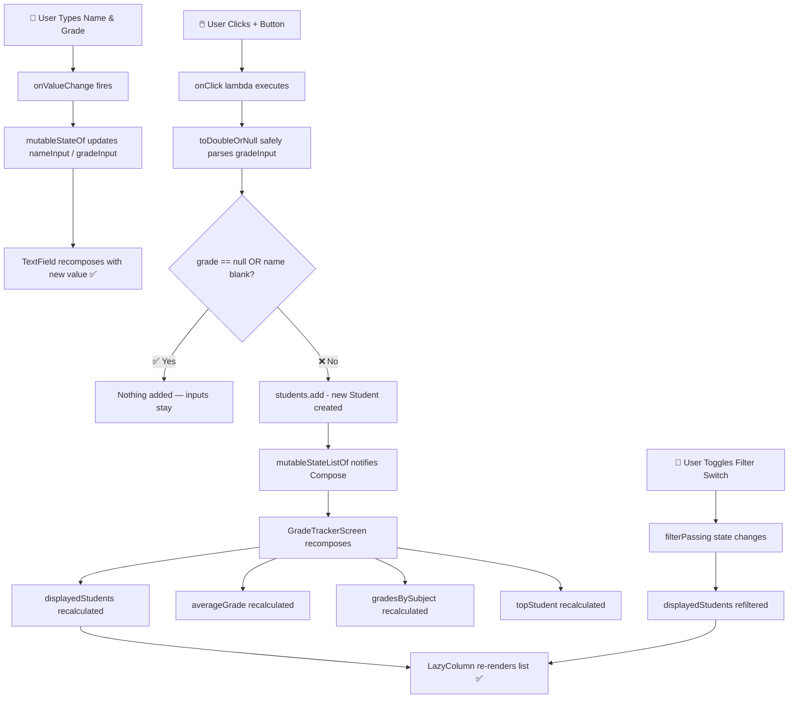
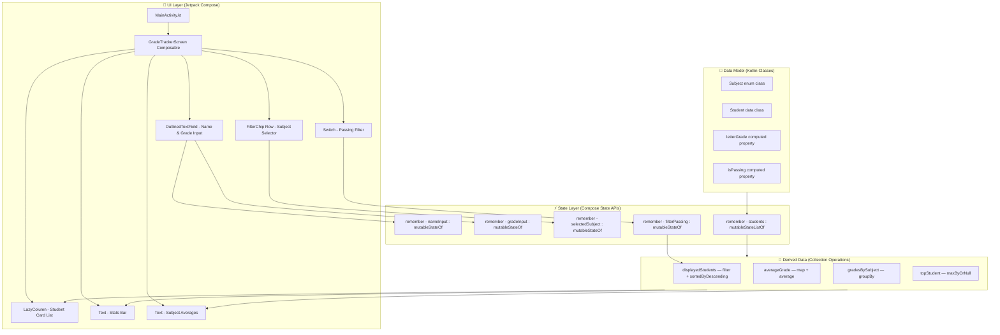
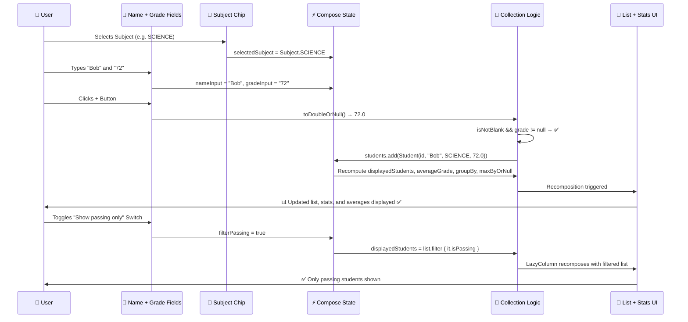
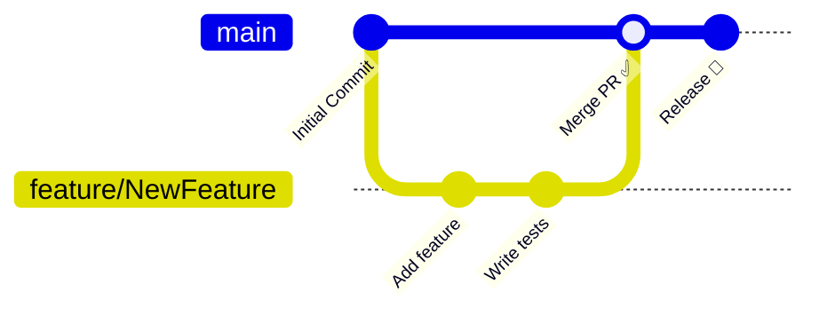

<div align="center">


<br/>

[](https://git.io/typing-svg)

<br/>

[](https://android.com)
[](https://kotlinlang.org)
[](https://developer.android.com/jetpack/compose)
[](https://m3.material.io)
[](LICENSE)
[](https://github.com/atanucsejgec/StudentGradeTracker/stargazers)
[](https://github.com/atanucsejgec/StudentGradeTracker/issues)
[](https://github.com/atanucsejgec/StudentGradeTracker/commits)

<br/>

> 📊 **Student Grade Tracker** is a beautifully crafted Android app that lets you
> add, filter, and analyze student grades across multiple subjects — built with
> **Jetpack Compose**, **Material 3**, and core modern Kotlin concepts like
> **enum classes**, **data classes**, and **collection operations**.

<br/>

[📲 Download App](#-download) • [🚀 Getting Started](#️-getting-started) • [✨ Features](#-features) • [📚 Key Concepts](#-key-concepts-learned) • [🏗️ Architecture](#️-architecture) • [🤝 Contribute](#-contributing)

</div>

---

## 📖 Table of Contents

- [📌 About](#-about)
- [📲 Download](#-download)
- [📸 Screenshots](#-screenshots)
- [✨ Features](#-features)
- [📚 Key Concepts Learned](#-key-concepts-learned)
- [🛠️ Tech Stack](#️-tech-stack)
- [🏗️ Architecture](#️-architecture)
- [⚙️ Getting Started](#️-getting-started)
- [🧪 Running Tests](#-running-tests)
- [📦 Project Structure](#-project-structure)
- [🗺️ Roadmap](#️-roadmap)
- [🤝 Contributing](#-contributing)
- [👥 Contributors](#-contributors)
- [📄 License](#-license)
- [📬 Contact](#-contact)

---

## 📌 About

**Student Grade Tracker** is a clean and feature-rich Android app that lets teachers
or students **add**, **filter**, and **analyze** grades across subjects like Math,
Science, English, History, and Art. It provides real-time subject averages, a
top-performer highlight, and a passing filter — all powered by Kotlin's expressive
collection APIs.

This project is a **showcase of intermediate Kotlin & Android development** using:

- 🎨 **Jetpack Compose** for declarative, XML-free UI
- 💡 **Compose State APIs** (`remember`, `mutableStateOf`, `mutableStateListOf`) for reactive list updates
- 🗂️ **Kotlin Enum & Data Classes** for clean, structured data modeling
- 🔢 **Kotlin Collection Operations** — `filter`, `map`, `groupBy`, `sortedByDescending`, `maxByOrNull`
- 🏛️ **Single Activity Architecture** with a focused, minimal codebase

### 🎯 Who Is This For?

| Audience | Benefit |
|---|---|
| 👶 Android Beginners | Clean reference for Compose list state with `mutableStateListOf` |
| 📚 Kotlin Learners | Hands-on use of `enum`, `data class`, and collection operations |
| 🎨 UI/UX Enthusiasts | Modern Material 3 cards, chips, and dynamic color feedback |
| 🏫 Educators / Students | A practical grade management tool for real use |
| 🚀 Compose Explorers | See `LazyColumn`, `FilterChip`, `Switch`, and `LaunchedEffect` in action |

---

## 📲 Download

<div align="center">

[](https://github.com/atanucsejgec/StudentGradeTracker/releases)
[](#)

</div>

---

## 📸 Screenshots

> 💡 A clean, card-based UI built entirely with Jetpack Compose and Material 3.

<div align="center">

<table>
  <tr>
    <td align="center"><b>Grade List View</b></td>
    <td align="center"><b>Filter & Stats View</b></td>
  </tr>
  <tr>
    <td>
      
    </td>
    <td>
      
    </td>
  </tr>
</table>

</div>

---

## ✨ Features

<table>
  <tr>
    <td>🎨 <b>Modern Compose UI</b></td>
    <td>Built entirely with <b>Jetpack Compose</b> and <b>Material 3</b> — no XML layouts, pure declarative UI</td>
  </tr>
  <tr>
    <td>📐 <b>Multi-Subject Tracking</b></td>
    <td>Track grades across <b>Math, Science, English, History, and Art</b> with emoji-coded subject chips</td>
  </tr>
  <tr>
    <td>➕ <b>Add Students Dynamically</b></td>
    <td>Enter a student name and marks, select a subject, and add them to the live list instantly</td>
  </tr>
  <tr>
    <td>🔢 <b>Reactive List with mutableStateListOf</b></td>
    <td>Uses Compose-aware <code>mutableStateListOf</code> to automatically re-render the list on every add</td>
  </tr>
  <tr>
    <td>📊 <b>Live Statistics</b></td>
    <td>Real-time <b>class average</b>, <b>top student</b>, and <b>total count</b> computed from the current list</td>
  </tr>
  <tr>
    <td>🔬 <b>Subject Averages</b></td>
    <td>Automatically groups students by subject using <code>groupBy</code> and displays per-subject average grades</td>
  </tr>
  <tr>
    <td>✅ <b>Passing Filter</b></td>
    <td>Toggle a <b>Switch</b> to instantly show only students who are passing (grade ≥ 60)</td>
  </tr>
  <tr>
    <td>🔴🟢 <b>Color-Coded Results</b></td>
    <td>Passing students shown in <b>Green</b>, failing students in <b>Red</b> — at a glance performance view</td>
  </tr>
  <tr>
    <td>🔡 <b>Letter Grade Conversion</b></td>
    <td>Automatically computes <b>A / B / C / D / F</b> letter grades from numeric scores via a computed property</td>
  </tr>
  <tr>
    <td>🛡️ <b>Safe Input Handling</b></td>
    <td>Uses <code>toDoubleOrNull()</code> to safely parse grade input — no crashes on invalid or empty text</td>
  </tr>
  <tr>
    <td>📦 <b>Pre-Populated Sample Data</b></td>
    <td>App launches with 6 sample students via <code>LaunchedEffect</code> for immediate visual feedback</td>
  </tr>
  <tr>
    <td>🏛️ <b>Single Activity Design</b></td>
    <td>Clean architecture with a single <code>MainActivity.kt</code> as the only entry point</td>
  </tr>
</table>

---

## 📚 Key Concepts Learned

> 💡 This project was built as a **hands-on learning experience** with Kotlin & Jetpack Compose.
> Here are the core concepts explored and applied through this app:

---

### 🗂️ 1. Enum Class — Predefined Set of Constants

```kotlin
enum class Subject(val emoji: String) {
    MATH("📐"),
    SCIENCE("🔬"),
    ENGLISH("📚"),
    HISTORY("🏛️"),
    ART("🎨")
}
```

- An `enum class` defines a **fixed, named set of constants**
- Each constant can carry **properties** (like `emoji` here)
- Prevents invalid values — you can only assign one of the declared constants
- Access all values with `Subject.values()` — used here to generate filter chips

| Enum Constant | emoji Property |
|---|---|
| `Subject.MATH` | 📐 |
| `Subject.SCIENCE` | 🔬 |
| `Subject.ENGLISH` | 📚 |
| `Subject.HISTORY` | 🏛️ |
| `Subject.ART` | 🎨 |

> 💡 Use `enum class` when you have a **closed, known set** of values
> that represent categories or types.

---

### 🧱 2. Data Class — Structured Data with Auto-Generated Utilities

```kotlin
data class Student(
    val id: Int,
    val name: String,
    val subject: Subject,
    val grade: Double
)
```

- A `data class` **auto-generates** `toString()`, `equals()`, `hashCode()`, and `copy()`
- Ideal for **model/data holder** objects
- Supports **destructuring** — unpack properties positionally

```kotlin
// Destructuring a data class instance
val (id, name, subject, grade) = student
```

| Auto-Generated | What It Does |
|---|---|
| `toString()` | Prints all properties in a readable format |
| `equals()` | Compares two instances by their property values |
| `hashCode()` | Consistent hash based on property values |
| `copy()` | Creates a new instance with some properties changed |

---

### ⚙️ 3. Computed Properties in Data Class

```kotlin
val letterGrade: String
    get() = when {
        grade >= 90 -> "A"
        grade >= 80 -> "B"
        grade >= 70 -> "C"
        grade >= 60 -> "D"
        else        -> "F"
    }

val isPassing: Boolean get() = grade >= 60
```

- A **computed property** has no backing field — it runs logic every time it's accessed
- Uses the `get()` syntax to define a custom getter
- `letterGrade` uses a `when` expression to map numeric grade → letter
- `isPassing` is a simple boolean check used for filtering and color-coding

| Grade Range | Letter Grade | isPassing |
|---|---|---|
| 90 – 100 | A | ✅ true |
| 80 – 89 | B | ✅ true |
| 70 – 79 | C | ✅ true |
| 60 – 69 | D | ✅ true |
| Below 60 | F | ❌ false |

---

### ⚡ 4. Compose State — `remember`, `mutableStateOf`, `mutableStateListOf`

```kotlin
var nameInput       by remember { mutableStateOf("") }
var gradeInput      by remember { mutableStateOf("") }
var selectedSubject by remember { mutableStateOf(Subject.MATH) }
var filterPassing   by remember { mutableStateOf(false) }

val students = remember { mutableStateListOf<Student>() }
```

| API | Role |
|-----|------|
| `mutableStateOf()` | Reactive single-value state — UI rebuilds when value changes |
| `mutableStateListOf()` | Reactive list state — UI rebuilds when items are added/removed |
| `remember {}` | Keeps state alive across recompositions |
| `by` delegation | Allows direct `nameInput = "..."` instead of `nameInput.value = "..."` |

> 💡 Use `mutableStateListOf` instead of `mutableStateOf(listOf())` when
> you need Compose to **react to individual list mutations** like `.add()` and `.remove()`.

---

### 🔄 5. Kotlin Collection Operations

This app is a practical showcase of Kotlin's powerful collection APIs:

#### 🔍 `filter` — Keep elements that match a condition

```kotlin
list.filter { it.isPassing }   // Only students with grade ≥ 60
```

#### 🔃 `sortedByDescending` — Sort from highest to lowest

```kotlin
.sortedByDescending { it.grade }   // Highest grade first
```

#### 🗺️ `map` — Transform each element

```kotlin
students.map { it.grade }.average()   // Extract grades, then average
```

#### 🗂️ `groupBy` — Group elements by a key

```kotlin
val gradesBySubject: Map<Subject, List<Student>> =
    students.groupBy { it.subject }
```

#### 🏆 `maxByOrNull` — Find element with max value (null-safe)

```kotlin
val topStudent: Student? = students.maxByOrNull { it.grade }
```

| Operation | Input | Output |
|---|---|---|
| `filter { it.isPassing }` | All students | Only passing students |
| `sortedByDescending { it.grade }` | Unsorted list | Highest → Lowest |
| `map { it.grade }.average()` | Student list | Class average (Double) |
| `groupBy { it.subject }` | Student list | `Map<Subject, List<Student>>` |
| `maxByOrNull { it.grade }` | Student list | Top student or `null` |

---

### ❓ 6. Safe Call Operator `?.` and Elvis Operator `?:`

```kotlin
// Safe call — only accesses .name if topStudent is not null
"Top: ${topStudent?.name ?: "N/A"}"
```

| Operator | Purpose | Example |
|---|---|---|
| `?.` | Call property/method only if not null | `topStudent?.name` |
| `?:` | Provide a fallback if the left side is null | `topStudent?.name ?: "N/A"` |

> 💡 `maxByOrNull` returns `null` on an empty list — the `?.` and `?:` operators
> handle this gracefully without a null pointer crash.

---

### 🔢 7. Safe Input Parsing with `toDoubleOrNull()`

```kotlin
val grade = gradeInput.toDoubleOrNull()
if (nameInput.isNotBlank() && grade != null) {
    students.add(Student(...))
}
```

| Input String | `toDoubleOrNull()` Result |
|---|---|
| `"95.5"` | `95.5` ✅ |
| `"72"` | `72.0` ✅ |
| `"abc"` | `null` ⚠️ |
| `""` (empty) | `null` ⚠️ |

> 💡 Guard clauses (`isNotBlank()` + `!= null`) prevent invalid data
> from ever entering the student list.

---

### 🗺️ 8. `groupBy` — Iterating Over a Map with Destructuring

```kotlin
val gradesBySubject: Map<Subject, List<Student>> =
    students.groupBy { it.subject }

// Iterating with destructuring
gradesBySubject.forEach { (subject, subjectStudents) ->
    val avg = subjectStudents.map { it.grade }.average()
    Text("${subject.emoji} ${subject.name}: ${"%.1f".format(avg)}")
}
```

- `groupBy` returns a `Map<Key, List<Value>>`
- `forEach { (subject, subjectStudents) ->` uses **destructuring** on the `Map.Entry`
- Combines `map` + `average()` to compute per-subject grade averages

---

### 🚀 9. `LaunchedEffect` — Running Side Effects in Compose

```kotlin
LaunchedEffect(Unit) {
    students.addAll(
        listOf(
            Student(1, "Alice", Subject.MATH, 95.0),
            Student(2, "Bob", Subject.SCIENCE, 72.0),
            // ...
        )
    )
}
```

- `LaunchedEffect(Unit)` runs **once** when the composable first enters composition
- Used here to pre-populate the student list with sample data
- `Unit` as the key means it will **never re-run** on recomposition

| Key Value | Effect Behavior |
|---|---|
| `Unit` | Runs exactly once on first composition |
| A state value | Reruns every time that state value changes |

---

### 🎨 10. Jetpack Compose UI Concepts Used

```kotlin
@Composable
fun GradeTrackerScreen() { ... }
```

| Composable / API | What It Does |
|---|---|
| `@Composable` | Marks a function as a Compose UI building block |
| `LazyColumn { items(...) }` | Efficiently renders a scrollable list — only visible items are composed |
| `FilterChip` | Selectable chip — used for subject selection row |
| `OutlinedTextField` | Material 3 text input with label |
| `Switch` | Toggle control for the passing filter |
| `Card` | Material 3 elevated card surface for each student row |
| `Row / Column` | Horizontal / vertical layout containers |
| `Arrangement.SpaceBetween` | Pushes children to opposite ends of a `Row` |
| `Modifier.weight(1f)` | Makes a composable fill remaining space proportionally |
| `Color.Green / Color.Red` | Dynamic text color based on `isPassing` boolean |
| `"%.1f".format(avg)` | Formats a Double to 1 decimal place for display |

---

### 🔄 11. Recomposition Flow — How It All Works Together


```mermaid
graph TD
    A[👤 User Types Name & Grade] --> B[onValueChange fires]
    B --> C[mutableStateOf updates nameInput / gradeInput]
    C --> D[TextField recomposes with new value ✅]

    E[🖱️ User Clicks + Button] --> F[onClick lambda executes]
    F --> G[toDoubleOrNull safely parses gradeInput]
    G --> H{grade == null OR name blank?}
    H -- ✅ Yes --> I[Nothing added — inputs stay]
    H -- ❌ No --> J[students.add - new Student created]
    J --> K[mutableStateListOf notifies Compose]
    K --> L[GradeTrackerScreen recomposes]
    L --> M[displayedStudents recalculated]
    L --> N[averageGrade recalculated]
    L --> O[gradesBySubject recalculated]
    L --> P[topStudent recalculated]
    M --> Q[LazyColumn re-renders list ✅]

    R[🔘 User Toggles Filter Switch] --> S[filterPassing state changes]
    S --> T[displayedStudents refiltered]
    T --> Q
```

---

### 🗂️ Summary — All Concepts at a Glance

| # | Concept | Where Used in Code |
|---|---------|-------------------|
| 1 | `enum class` with properties | `Subject` enum with `emoji` property |
| 2 | `data class` with auto-utilities | `Student` data class |
| 3 | Computed properties (`get()`) | `letterGrade` and `isPassing` in `Student` |
| 4 | `remember` + `mutableStateOf` | All input and filter state variables |
| 5 | `mutableStateListOf` | Reactive student list in `GradeTrackerScreen` |
| 6 | `filter` collection operation | Passing filter toggle |
| 7 | `sortedByDescending` | Sorting students by grade descending |
| 8 | `map` + `average()` | Class-wide and per-subject grade averages |
| 9 | `groupBy` | Grouping students by `Subject` |
| 10 | `maxByOrNull` | Finding the top-performing student |
| 11 | Safe call `?.` and Elvis `?:` | Null-safe top student name display |
| 12 | `toDoubleOrNull()` | Safe grade input parsing |
| 13 | Destructuring | `val (id, name, subject, grade) = student` |
| 14 | `LaunchedEffect(Unit)` | Pre-populating sample student data |
| 15 | `LazyColumn` + `items()` | Efficient scrollable student list |
| 16 | `FilterChip` + `Switch` | Subject selector and passing toggle |

---

## 🛠️ Tech Stack

<div align="center">

[](https://skillicons.dev)

</div>

<br/>

| Category | Technology | Purpose |
|---|---|---|
| 🌐 **Language** | Kotlin 1.9+ | Primary programming language |
| 🎨 **UI Framework** | Jetpack Compose | Declarative modern UI toolkit |
| 🖌️ **Design System** | Material 3 | Components, theming & dynamic color |
| 🧠 **State Management** | `remember` + `mutableStateListOf` | Reactive list UI without ViewModel |
| 🏛️ **Architecture** | Single Activity + Compose | Minimal, focused app structure |
| 🧪 **Unit Testing** | JUnit 4 | Local business logic tests |
| 🤖 **UI Testing** | AndroidJUnit4 | Instrumented Compose UI tests |
| 🔧 **Build System** | Gradle (Kotlin DSL) | Build and dependency automation |

---

## 🏗️ Architecture

Student Grade Tracker follows a **streamlined Compose-first architecture**, keeping
state and logic co-located with the UI — ideal for a focused utility app.

### 📐 Architecture Diagram


```mermaid
graph TB
    subgraph UI["🎨 UI Layer (Jetpack Compose)"]
        MA[MainActivity.kt]
        GTS[GradeTrackerScreen Composable]
        FC[FilterChip Row - Subject Selector]
        TF[OutlinedTextField - Name & Grade Input]
        SW[Switch - Passing Filter]
        LC[LazyColumn - Student Card List]
        ST[Text - Stats Bar]
        SA[Text - Subject Averages]
    end

    subgraph State["⚡ State Layer (Compose State APIs)"]
        NI[remember - nameInput : mutableStateOf]
        GI[remember - gradeInput : mutableStateOf]
        SS[remember - selectedSubject : mutableStateOf]
        FP[remember - filterPassing : mutableStateOf]
        SL[remember - students : mutableStateListOf]
    end

    subgraph Logic["🧮 Derived Data (Collection Operations)"]
        DS[displayedStudents — filter + sortedByDescending]
        AG[averageGrade — map + average]
        GS[gradesBySubject — groupBy]
        TS[topStudent — maxByOrNull]
    end

    subgraph Model["🧱 Data Model (Kotlin Classes)"]
        EN[Subject enum class]
        DC[Student data class]
        CP[letterGrade computed property]
        IP[isPassing computed property]
    end

    MA --> GTS
    GTS --> FC & TF & SW & LC & ST & SA
    FC --> SS
    TF --> NI & GI
    SW --> FP
    SL --> Logic
    FP --> DS
    Logic --> LC & ST & SA
    Model --> SL
```

### 🔄 State Flow Diagram


```mermaid
sequenceDiagram
    participant User as 👤 User
    participant Input as 📝 Name + Grade Fields
    participant Chip as 🔘 Subject Chip
    participant State as ⚡ Compose State
    participant Logic as 🧮 Collection Logic
    participant UI as 🎨 List + Stats UI

    User->>Chip: Selects Subject (e.g. SCIENCE)
    Chip->>State: selectedSubject = Subject.SCIENCE

    User->>Input: Types "Bob" and "72"
    Input->>State: nameInput = "Bob", gradeInput = "72"

    User->>Input: Clicks + Button
    Input->>Logic: toDoubleOrNull() → 72.0
    Logic->>Logic: isNotBlank && grade != null → ✅
    Logic->>State: students.add(Student(id, "Bob", SCIENCE, 72.0))
    State->>Logic: Recompute displayedStudents, averageGrade, groupBy, maxByOrNull
    Logic->>UI: Recomposition triggered
    UI->>User: 📊 Updated list, stats, and averages displayed ✅

    User->>Input: Toggles "Show passing only" Switch
    Input->>State: filterPassing = true
    State->>Logic: displayedStudents = list.filter { it.isPassing }
    Logic->>UI: LazyColumn recomposes with filtered list
    UI->>User: ✅ Only passing students shown
```

### 🧱 Layer Responsibilities

| Layer | Component | Responsibility |
|---|---|---|
| **Model** | `Subject` enum, `Student` data class | Data structure, letter grade, pass/fail logic |
| **State** | `mutableStateOf`, `mutableStateListOf` | Holds all reactive UI state |
| **Logic** | Collection operations in composable | Derives display list, averages, groupings |
| **UI** | `GradeTrackerScreen`, composables | Renders input, cards, chips, stats |

---

## ⚙️ Getting Started

### Prerequisites

- ✅ Android Studio **Giraffe** or newer
- ✅ JDK **17+**
- ✅ Android device or emulator running **API 24+** (Android 7.0)
- ✅ Kotlin **1.9.0+**

### Installation

**1. Clone the repository**

```bash
git clone https://github.com/atanucsejgec/StudentGradeTracker.git
cd StudentGradeTracker
```

**2. Open in Android Studio**

```
File → Open → Select the cloned StudentGradeTracker folder
```

**3. Sync Gradle**

```bash
./gradlew build
```

**4. Run the App**

```bash
# Via terminal
./gradlew installDebug

# Or press Shift + F10 in Android Studio
```

> 💡 No API keys or external configurations needed — just clone and run!

---

## 🧪 Running Tests

```bash
# ✅ Run all Unit Tests
./gradlew test

# ✅ Run Instrumented UI Tests (requires connected device or emulator)
./gradlew connectedAndroidTest

# ✅ Run with verbose output for debugging
./gradlew test --info
```

| Test Type | Command | Source Location |
|---|---|---|
| Unit Tests | `./gradlew test` | `src/test/java/` |
| Instrumented Tests | `./gradlew connectedAndroidTest` | `src/androidTest/java/` |

---

## 📦 Project Structure

```
📦 com.apk.studentgradetracker
│
├── 📂 ui/
│   └── 📂 theme/
│       ├── 🎨 Color.kt           # Light & Dark color palettes (Material 3)
│       ├── 🔤 Typography.kt      # Font styles and text hierarchy
│       └── 🖌️ Theme.kt           # App theme + dynamic color (Android 12+)
│
├── 📄 MainActivity.kt            # 🏠 App entry point + all app logic
│                                 #    ├── Subject — enum class with emoji
│                                 #    ├── Student — data class with computed props
│                                 #    ├── GradeTrackerScreen() — main composable
│                                 #    ├── mutableStateListOf — reactive student list
│                                 #    ├── LaunchedEffect — sample data population
│                                 #    ├── filter, sortedByDescending, map, groupBy
│                                 #    ├── maxByOrNull — top student finder
│                                 #    ├── toDoubleOrNull() — safe input parsing
│                                 #    ├── LazyColumn + FilterChip + Switch
│                                 #    └── Color-coded pass/fail display
│
├── 📄 ExampleUnitTest.kt         # 🧪 Local unit test verifications
└── 📄 ExampleInstrumentedTest.kt # 🤖 Instrumented UI tests
```

---

## 🗺️ Roadmap


```mermaid
graph LR
    subgraph DONE["✅ Completed"]
        A[Jetpack Compose UI]
        B[Enum class — Subject]
        C[Data class — Student]
        D[Computed Properties]
        E[mutableStateListOf]
        F[filter + sortedBy + groupBy]
        G[Safe Input Parsing]
        H[Color-Coded Pass/Fail]
        I[Subject Averages]
        J[LaunchedEffect Sample Data]
    end

    subgraph WIP["🔄 In Progress"]
        K[Accessibility Improvements]
        L[UI Test Coverage]
    end

    subgraph PLAN["📋 Planned"]
        M[Edit & Delete Student Entry]
        N[Persistent Storage - Room DB]
        O[Export Grades as CSV]
        P[Grade Distribution Chart]
        Q[Search by Student Name]
        R[Play Store Release]
    end

    DONE --> WIP --> PLAN
```

| Status | Feature |
|---|---|
| ✅ Done | Jetpack Compose declarative UI |
| ✅ Done | Enum class for Subject with emoji |
| ✅ Done | Data class for Student with computed properties |
| ✅ Done | Reactive list with `mutableStateListOf` |
| ✅ Done | `filter`, `sortedByDescending`, `map`, `groupBy`, `maxByOrNull` |
| ✅ Done | Safe grade input parsing with `toDoubleOrNull()` |
| ✅ Done | Color-coded pass (🟢) / fail (🔴) display |
| ✅ Done | Per-subject average grade breakdown |
| ✅ Done | Pre-populated sample data via `LaunchedEffect` |
| 🔄 In Progress | Enhanced accessibility — TalkBack support |
| 🔄 In Progress | Complete UI test coverage |
| 📋 Planned | Edit and delete existing student entries |
| 📋 Planned | Persistent local storage with Room Database |
| 📋 Planned | Export grade report as CSV file |
| 📋 Planned | Grade distribution bar/pie chart |
| 💡 Idea | Search/filter by student name |
| 💡 Idea | Google Play Store release |

---

## 🤝 Contributing

Contributions are **always welcome**! 🚀


```mermaid
gitGraph
   commit id: "Initial Commit"
   branch feature/NewFeature
   checkout feature/NewFeature
   commit id: "Add feature"
   commit id: "Write tests"
   checkout main
   merge feature/NewFeature id: "Merge PR ✅"
   commit id: "Release 🚀"
```

**Steps to Contribute:**

1. **Fork** the project

2. **Create** your feature branch
   ```bash
   git checkout -b feature/AmazingFeature
   ```

3. **Commit** your changes using Conventional Commits
   ```bash
   git commit -m "feat: add grade export feature"
   ```

4. **Push** to your branch
   ```bash
   git push origin feature/AmazingFeature
   ```

5. **Open** a Pull Request 🎉

### 📋 Commit Convention

| Prefix | Purpose | Example |
|---|---|---|
| `feat:` | New feature | `feat: add grade export to CSV` |
| `fix:` | Bug fix | `fix: incorrect average on empty list` |
| `refactor:` | Code refactor | `refactor: extract student card composable` |
| `test:` | Add/update tests | `test: add unit test for letterGrade` |
| `docs:` | Documentation update | `docs: update README key concepts` |
| `chore:` | Config or build changes | `chore: update gradle version` |
| `style:` | UI or styling tweaks | `style: update card padding` |

### 📋 Contribution Guidelines

- Follow **Kotlin coding conventions** throughout
- Write **unit tests** for any new logic added
- Keep Composables **small, focused and reusable**
- Follow **Material 3** guidelines for any UI changes
- Update **README** for any structural or feature changes
- Use **conventional commits** for all commit messages

---

## 👥 Contributors

<div align="center">

[](https://github.com/atanucsejgec/StudentGradeTracker/graphs/contributors)

*Made with [contrib.rocks](https://contrib.rocks)*

</div>

---

## 📄 License

Distributed under the **MIT License**. See [`LICENSE`](LICENSE) for full details.

```
MIT License

Copyright (c) 2024 Atanu Biswas

Permission is hereby granted, free of charge, to any person obtaining a copy
of this software and associated documentation files (the "Software"), to deal
in the Software without restriction, including without limitation the rights
to use, copy, modify, merge, publish, distribute, sublicense, and/or sell
copies of the Software, and to permit persons to whom the Software is
furnished to do so, subject to the following conditions:

The above copyright notice and this permission notice shall be included in
all copies or substantial portions of the Software.
```

---

## 📬 Contact

<div align="center">

**Atanu Biswas**

[](https://github.com/atanucsejgec)
[](https://github.com/atanucsejgec/StudentGradeTracker)

📌 **Project Link:** [https://github.com/atanucsejgec/StudentGradeTracker](https://github.com/atanucsejgec/StudentGradeTracker)

</div>

---

<div align="center">

### ⭐ If Student Grade Tracker helped you learn or saved you time, drop a Star — it really means a lot! ⭐


</div>

